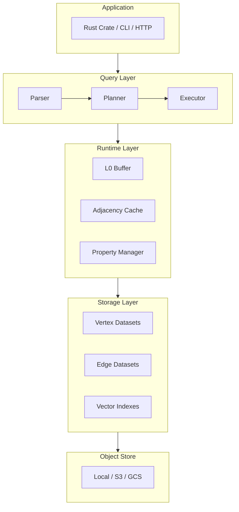
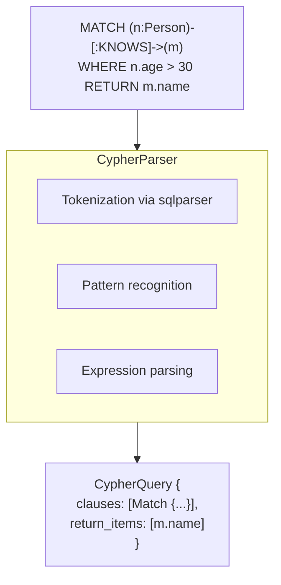
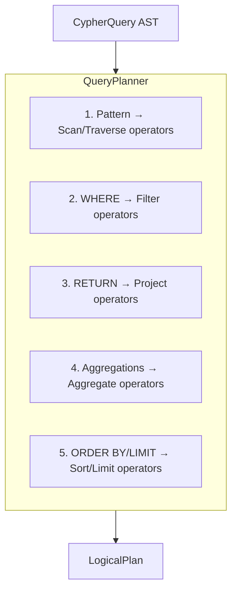
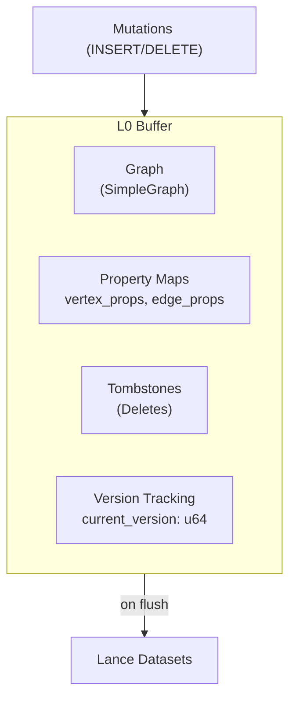
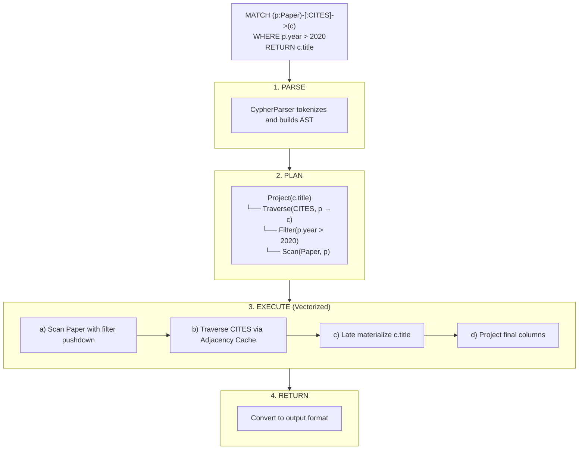
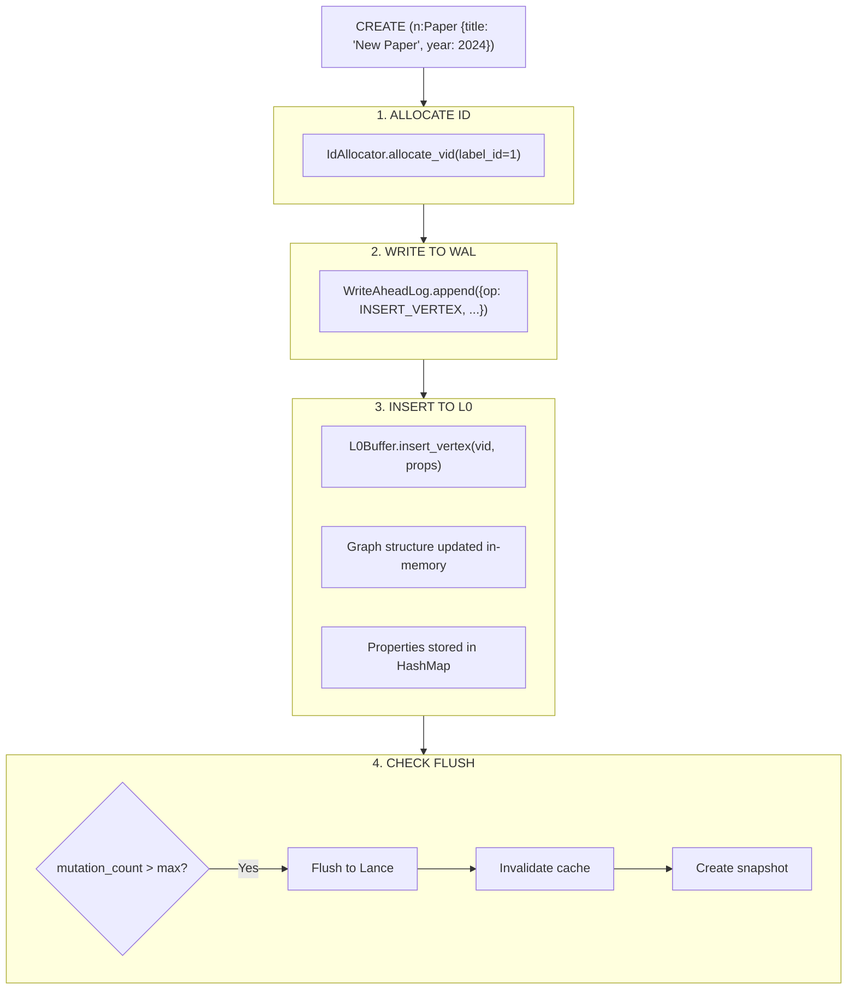

# Architecture

Uni's architecture is designed for high performance, flexibility, and simplicity. This document provides a comprehensive overview of the system's layers, components, and data flow.

## Design Principles

Before diving into the architecture, understand the key principles that guided Uni's design:

| Principle | Description |
|-----------|-------------|
| **Embedded First** | No separate server process; runs as a library in your application |
| **Multi-Model Unity** | Graph, vector, document, and columnar in one engine, not bolted together |
| **Object-Store Native** | Designed for cloud storage (S3/GCS/Azure) with local caching for low-latency |
| **Vectorized Execution** | Batch processing with Apache Arrow for 100x+ speedups |
| **Single-Writer Simplicity** | No distributed consensus; one writer, many readers, snapshot isolation |
| **Late Materialization** | Load properties only when needed to minimize I/O |
| **Time-Based Durability** | Auto-flush ensures data reaches storage within configurable intervals |

---

## System Overview

```
┌─────────────────────────────────────────────────────────────────────────────┐
│                              APPLICATION                                     │
│                                                                             │
│   ┌───────────────┐   ┌───────────────┐   ┌───────────────┐                │
│   │  Rust Crate   │   │    CLI Tool   │   │  HTTP Server  │                │
│   │   (Library)   │   │               │   │   (Optional)  │                │
│   └───────┬───────┘   └───────┬───────┘   └───────┬───────┘                │
│           │                   │                   │                         │
│           └───────────────────┴───────────────────┘                         │
│                               │                                             │
├───────────────────────────────┼─────────────────────────────────────────────┤
│                               ▼                                             │
│   ┌─────────────────────────────────────────────────────────────────────┐   │
│   │                         QUERY LAYER                                  │   │
│   │  ┌──────────────┐  ┌──────────────┐  ┌──────────────────────────┐   │   │
│   │  │    Parser    │→ │   Planner    │→ │  Vectorized Executor     │   │   │
│   │  │   (Cypher)   │  │ (Optimizer)  │  │    (Arrow Batches)       │   │   │
│   │  └──────────────┘  └──────────────┘  └──────────────────────────┘   │   │
│   └─────────────────────────────────────────────────────────────────────┘   │
│                               │                                             │
├───────────────────────────────┼─────────────────────────────────────────────┤
│                               ▼                                             │
│   ┌─────────────────────────────────────────────────────────────────────┐   │
│   │                        RUNTIME LAYER                                 │   │
│   │  ┌──────────────┐  ┌──────────────┐  ┌──────────────────────────┐   │   │
│   │  │  L0 Buffer   │  │  Adjacency   │  │   Property Manager       │   │   │
│   │  │  (Mutations) │  │    Cache     │  │    (Lazy Loading)        │   │   │
│   │  └──────────────┘  └──────────────┘  └──────────────────────────┘   │   │
│   │  ┌──────────────┐  ┌──────────────┐  ┌──────────────────────────┐   │   │
│   │  │    Writer    │  │     WAL      │  │    Graph Algorithms      │   │   │
│   │  │ (Coordinator)│  │  (Durability)│  │   (PageRank, WCC...)     │   │   │
│   │  └──────────────┘  └──────────────┘  └──────────────────────────┘   │   │
│   └─────────────────────────────────────────────────────────────────────┘   │
│                               │                                             │
├───────────────────────────────┼─────────────────────────────────────────────┤
│                               ▼                                             │
│   ┌─────────────────────────────────────────────────────────────────────┐   │
│   │                       STORAGE LAYER                                  │   │
│   │  ┌──────────────┐  ┌──────────────┐  ┌──────────────────────────┐   │   │
│   │  │   Vertex     │  │    Edge      │  │     Adjacency            │   │   │
│   │  │  Datasets    │  │  Datasets    │  │     Datasets             │   │   │
│   │  └──────────────┘  └──────────────┘  └──────────────────────────┘   │   │
│   │  ┌──────────────┐  ┌──────────────┐  ┌──────────────────────────┐   │   │
│   │  │   Vector     │  │   Scalar     │  │      Snapshot            │   │   │
│   │  │   Indexes    │  │   Indexes    │  │      Manifests           │   │   │
│   │  └──────────────┘  └──────────────┘  └──────────────────────────┘   │   │
│   └─────────────────────────────────────────────────────────────────────┘   │
│                               │                                             │
├───────────────────────────────┼─────────────────────────────────────────────┤
│                               ▼                                             │
│   ┌─────────────────────────────────────────────────────────────────────┐   │
│   │                       OBJECT STORE                                   │   │
│   │                                                                      │   │
│   │      ┌──────────┐     ┌──────────┐     ┌──────────────────┐         │   │
│   │      │   Local  │     │    S3    │     │   GCS / Azure    │         │   │
│   │      │   Disk   │     │          │     │                  │         │   │
│   │      └──────────┘     └──────────┘     └──────────────────┘         │   │
│   └─────────────────────────────────────────────────────────────────────┘   │
│                                                                             │
└─────────────────────────────────────────────────────────────────────────────┘
```

### Data Flow Diagram



---

## Query Layer

The Query Layer transforms Cypher text into optimized execution plans.

### Parser

Converts OpenCypher query strings into an Abstract Syntax Tree (AST).



**Supported Constructs:**
- Node patterns: `(n:Label {prop: value})`
- Edge patterns: `-[:TYPE]->`, `<-[:TYPE]-`, `-[:TYPE]-`
- WHERE predicates: comparison, boolean logic, IN, IS NULL
- Aggregations: COUNT, SUM, AVG, MIN, MAX, COLLECT
- Procedures: `CALL db.idx.vector.query(...)`

### Planner

Transforms the AST into a Logical Plan with optimizations.



**Key Optimizations:**
- **Predicate Pushdown**: Push filters to storage layer (Lance)
- **Projection Pruning**: Only load required columns
- **Index Selection**: Choose optimal indexes for scans
- **Join Ordering**: Optimize multi-pattern queries

### Vectorized Executor

Executes logical plans using columnar batch processing.

```rust
// Conceptual execution flow
let batch = scan_operator.execute()?;        // Load VIDs in batch
let batch = filter_operator.execute(batch)?; // Apply selection mask
let batch = traverse_operator.execute(batch)?; // Batch neighbor lookup
let batch = project_operator.execute(batch)?; // Select columns
```

**Execution Model:**
- **VectorizedBatch**: Arrow RecordBatch + selection mask
- **Morsel-Driven**: 1024-4096 rows per batch for cache efficiency
- **Pipeline Execution**: Chain operators without materialization
- **SIMD Acceleration**: Arrow compute kernels for filters/projections

[Learn more about Vectorized Execution →](../internals/vectorized-execution.md)

---

## Runtime Layer

The Runtime Layer manages in-memory state, caching, and write coordination.

### L0 Buffer

In-memory buffer for uncommitted mutations. All writes land here first.



**Characteristics:**
- Row-oriented for fast single-record inserts
- Backed by Write-Ahead Log for durability
- Flushed to L1 (Lance) when size threshold reached
- Read-your-writes semantics for queries

### Adjacency Cache

In-memory CSR (Compressed Sparse Row) cache for O(1) neighbor lookups.

```
       ┌─────────────────────────────────────────────────────────────┐
       │                   Adjacency Cache                           │
       │                                                             │
       │  EdgeType: CITES                                            │
       │  ┌─────────────────────────────────────────────────────┐   │
       │  │  Vertex 0:  neighbors=[1, 5, 12]   edges=[e0, e1, e2]│   │
       │  │  Vertex 1:  neighbors=[0, 3]       edges=[e3, e4]    │   │
       │  │  Vertex 2:  neighbors=[0, 1, 3, 7] edges=[e5,e6,e7,e8]│   │
       │  │  ...                                                  │   │
       │  └─────────────────────────────────────────────────────┘   │
       │                                                             │
       │  Storage: DashMap<(EdgeType, Direction), CsrIndex>         │
       │  Eviction: LRU-based, configurable max size                │
       └─────────────────────────────────────────────────────────────┘
```

**Benefits:**
- Eliminates storage round-trips for traversals
- Batch neighbor lookups for entire VectorizedBatch
- Automatic cache invalidation on L0 flush
- Concurrent read access via DashMap

### Property Manager

Lazy-loads vertex/edge properties from storage on demand.

```
         Query needs n.title, n.year
              │
              ▼
       ┌─────────────────────────────────────────────────────────────┐
       │                   Property Manager                          │
       │                                                             │
       │  1. Check LRU cache for (vid, property)                     │
       │  2. If miss: batch load from Lance                          │
       │  3. Columnar loading for vectorized access                  │
       │                                                             │
       │  ┌─────────────────────────────────────────────────────┐   │
       │  │  Cache: LruCache<(Vid, String), Value>              │   │
       │  │  Capacity: configurable (default: 10,000 entries)   │   │
       │  └─────────────────────────────────────────────────────┘   │
       └─────────────────────────────────────────────────────────────┘
```

**Loading Strategies:**
- **Single Property**: `get_vertex_prop(vid, "name")`
- **Batch Load**: `get_batch_vertex_props(vids, ["name", "age"])`
- **Columnar Load**: `load_properties_columnar(vids, props)` → Arrow arrays

### Writer

Coordinates mutations with L0 buffer and WAL.

```rust
// Writer coordination flow
pub struct Writer {
    l0_manager: Arc<L0Manager>,      // L0 buffer access
    storage: Arc<StorageManager>,    // Storage layer
    allocator: Arc<IdAllocator>,     // VID/EID allocation
    cache: Option<Arc<AdjacencyCache>>, // Cache invalidation
}

// Insert vertex
writer.insert_vertex(vid, properties)?; // → L0 + WAL
writer.check_flush()?;                   // → Maybe L0 → Lance
```

**Write Flow:**
1. Allocate VID via `IdAllocator`
2. Write to WAL for durability
3. Insert into L0 buffer
4. Return immediately (async durability)
5. Auto-flush when mutation threshold OR time interval reached

**Auto-Flush Triggers:**
- **Mutation count** (default: 10,000): Flush when buffer fills
- **Time interval** (default: 5 seconds): Flush after elapsed time with pending mutations
- Ensures data reaches storage/cloud within bounded time even on low-transaction systems

---

## Storage Layer

The Storage Layer provides durable, versioned, columnar storage via Lance.

### Lance Integration

[Lance](https://lancedb.github.io/lance/) is the core storage format, providing:

| Feature | Benefit |
|---------|---------|
| **Columnar Storage** | Efficient analytical scans |
| **Vector Indexes** | Native HNSW/IVF for ANN search |
| **Versioning** | Time-travel, snapshot isolation |
| **Object Store Native** | S3/GCS/Azure with automatic credential resolution |
| **Random Access** | Fast point lookups by row ID |
| **Hybrid Mode** | Local write cache + cloud storage for optimal latency |

### Dataset Layout

```
storage/
├── schema.json                    # Schema definition
├── snapshots/
│   └── manifest_v42.json         # Point-in-time snapshot
├── vertices_Paper/               # Per-label vertex dataset
│   ├── data/
│   │   ├── 0000.lance
│   │   └── 0001.lance
│   └── _versions/
│       └── 42.manifest
├── vertices_Author/
│   └── ...
├── edges_CITES/                  # Per-type edge dataset
│   └── ...
├── adj_out_CITES_Paper/          # Adjacency (outgoing, CITES, from Paper)
│   └── ...
├── adj_in_CITES_Paper/           # Adjacency (incoming, CITES, to Paper)
│   └── ...
├── indexes/
│   ├── vector_paper_embedding/   # Vector index
│   └── scalar_author_name/       # Scalar index
└── delta_CITES_out/              # LSM-style delta (L1)
    └── ...
```

### Vertex Dataset Schema

```
┌─────────────────────────────────────────────────────────────────────────────┐
│                        VertexDataset (per label)                            │
├──────────────┬────────────────────────────────────────────────────────────── │
│ Column       │ Description                                                  │
├──────────────┼──────────────────────────────────────────────────────────────┤
│ _vid         │ u64 - Internal vertex ID (label_id << 48 | offset)           │
│ _uid         │ [u8; 32] - UniId (SHA3-256 content hash)                     │
│ _deleted     │ bool - Soft delete flag                                      │
│ _version     │ u64 - Last modification version                              │
│ <properties> │ User-defined columns per schema                              │
└──────────────┴──────────────────────────────────────────────────────────────┘
```

### Edge Dataset Schema

```
┌─────────────────────────────────────────────────────────────────────────────┐
│                         EdgeDataset (per type)                              │
├──────────────┬──────────────────────────────────────────────────────────────┤
│ Column       │ Description                                                  │
├──────────────┼──────────────────────────────────────────────────────────────┤
│ eid          │ u64 - Internal edge ID (type_id << 48 | offset)              │
│ src_vid      │ u64 - Source vertex VID                                      │
│ dst_vid      │ u64 - Destination vertex VID                                 │
│ _deleted     │ bool - Soft delete flag                                      │
│ _version     │ u64 - Last modification version                              │
│ <properties> │ User-defined columns per schema                              │
└──────────────┴──────────────────────────────────────────────────────────────┘
```

### Adjacency Dataset

Optimized for O(1) neighbor lookups:

```
┌─────────────────────────────────────────────────────────────────────────────┐
│                    AdjacencyDataset (per edge type + direction)             │
├──────────────┬──────────────────────────────────────────────────────────────┤
│ Column       │ Description                                                  │
├──────────────┼──────────────────────────────────────────────────────────────┤
│ src_vid      │ u64 - Source vertex VID                                      │
│ neighbors    │ List<u64> - All neighbor VIDs                                │
│ edge_ids     │ List<u64> - Corresponding edge IDs                           │
└──────────────┴──────────────────────────────────────────────────────────────┘

Example row:
  src_vid=42, neighbors=[1, 7, 23, 99], edge_ids=[e1, e2, e3, e4]
```

---

## Data Flow Examples

### Query Execution Flow



### Write Flow



---

## Key Technologies

| Component | Technology | Purpose |
|-----------|------------|---------|
| **Storage Format** | Lance | Columnar, versioned, vector-native |
| **Columnar Runtime** | Apache Arrow | Zero-copy data representation |
| **Query Processing** | Custom vectorized engine | Morsel-driven batch execution |
| **Graph Runtime** | SimpleGraph (custom) | In-memory graph algorithms |
| **Object Store** | object_store | S3/GCS/Azure abstraction |
| **Parsing** | sqlparser | SQL/Cypher tokenization |
| **Concurrency** | DashMap, tokio | Thread-safe caching, async I/O |

---

## Next Steps

- [Data Model](data-model.md) — Understand vertices, edges, and properties
- [Identity Model](identity.md) — VID, EID, and UniId explained
- [Vectorized Execution](../internals/vectorized-execution.md) — Deep dive into batch processing
- [Storage Engine](../internals/storage-engine.md) — Lance integration and LSM design
