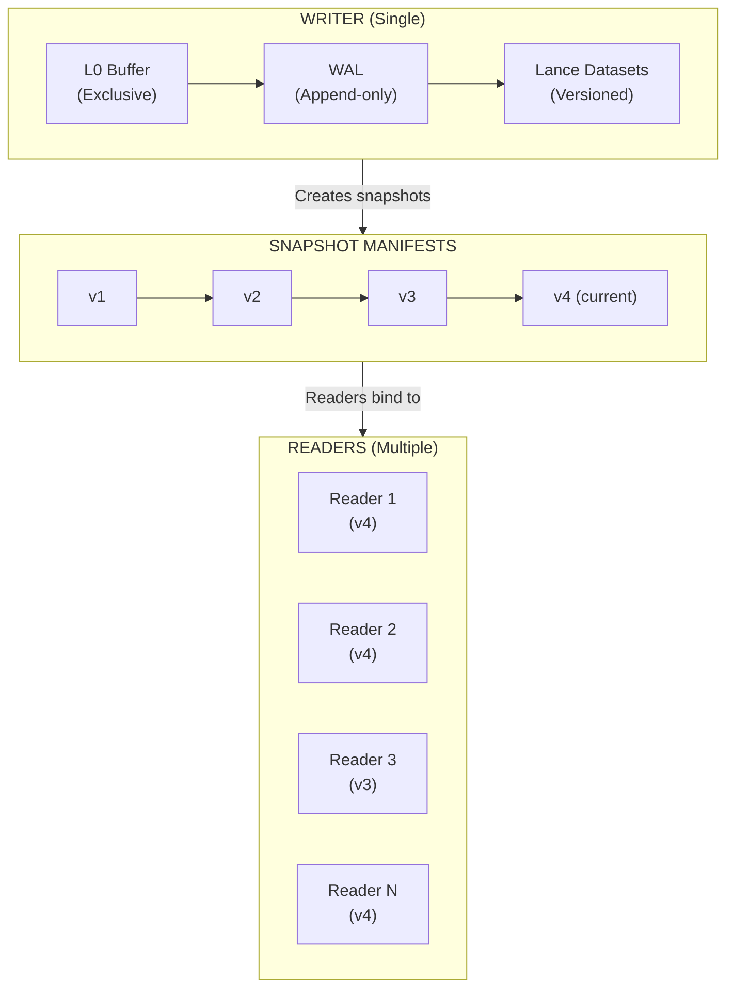
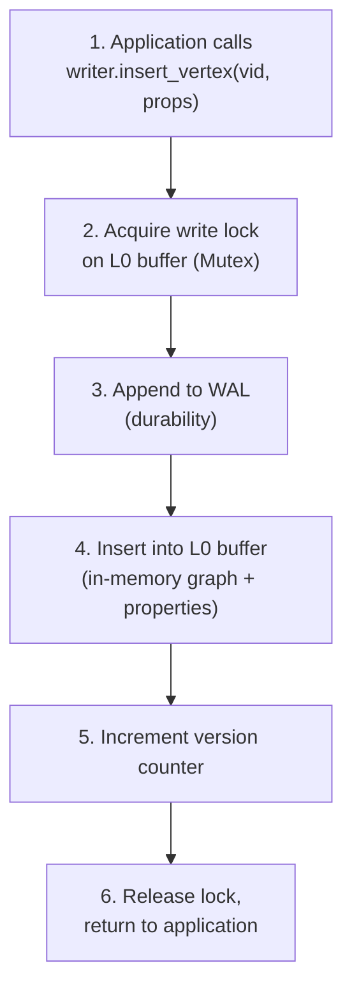
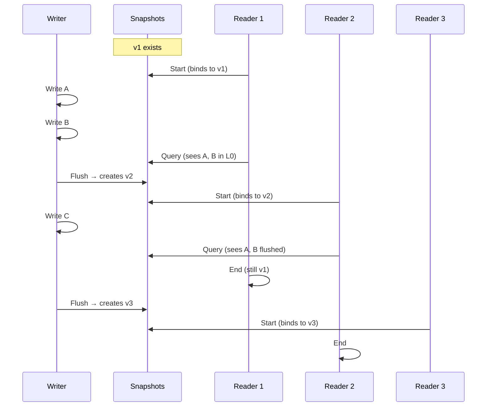
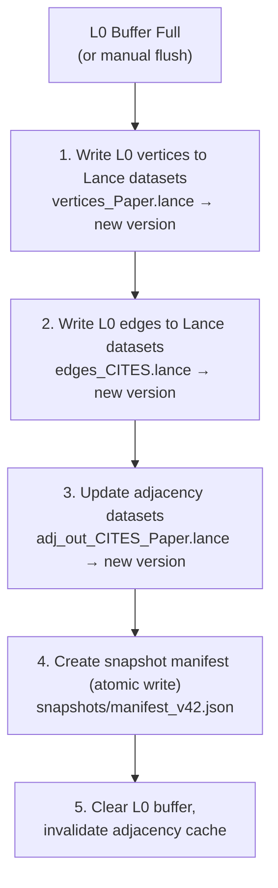
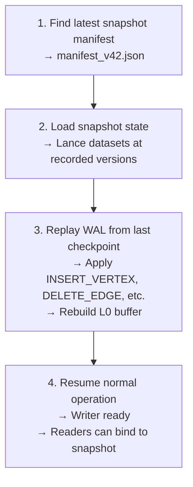

# Concurrency Model

Uni uses a single-writer, multi-reader concurrency model with snapshot-based isolation. This design provides simplicity, consistency, and predictable performance without the complexity of distributed consensus.

## Design Philosophy

Traditional distributed databases require complex consensus protocols (Raft, Paxos) to maintain consistency across replicas. Uni takes a different approach:

| Traditional Distributed | Uni's Approach |
|------------------------|----------------|
| Multiple writers | Single writer |
| Network consensus | Local coordination |
| Eventual consistency | Snapshot isolation |
| Complex conflict resolution | No conflicts by design |
| Operational complexity | Embedded simplicity |

This model is ideal for:
- Embedded databases in applications
- Batch processing pipelines
- Single-node analytics workloads
- Development and testing environments

---

## Architecture



---

## Single Writer

### Exclusive Write Access

Only one writer can modify the database at a time:

```rust
pub struct Writer {
    l0_manager: Arc<L0Manager>,      // Exclusive L0 access
    storage: Arc<StorageManager>,     // Storage coordination
    allocator: Arc<IdAllocator>,      // ID allocation
    // ...
}
```

### Write Flow



### Why Single Writer?

| Benefit | Explanation |
|---------|-------------|
| **No conflicts** | Writes are serialized, no concurrent modification issues |
| **Simple recovery** | WAL replay is deterministic |
| **Predictable latency** | No lock contention or retry loops |
| **Easier reasoning** | No need to reason about interleaved operations |
| **Efficient batching** | Buffer many writes before flush |

---

## Multiple Readers

### Snapshot Isolation

Readers operate on consistent snapshots of the database. Each snapshot represents a point-in-time view:

```rust
pub struct SnapshotManifest {
    snapshot_id: String,
    version: u64,
    timestamp: DateTime<Utc>,
    labels: HashMap<String, LabelSnapshot>,      // Lance version per label
    edge_types: HashMap<String, EdgeSnapshot>,   // Lance version per type
    adjacencies: HashMap<String, Vec<String>>,   // Adjacency chunks
}
```

### Reader Independence



### Read-Your-Writes

Readers can optionally include uncommitted L0 buffer data:

```rust
pub struct ExecutionContext {
    storage: Arc<StorageManager>,
    l0_buffer: Option<Arc<RwLock<L0Buffer>>>,  // Optional L0 access
    snapshot: SnapshotManifest,
}
```

**With L0 access:**
```cypher
-- Sees both committed (Lance) and uncommitted (L0) data
CREATE (n:Paper {title: "New Paper"})
MATCH (p:Paper) WHERE p.title = "New Paper"  -- Finds it immediately
RETURN p
```

**Without L0 access (snapshot-only):**
```cypher
-- Reader bound to v2, sees only committed data at v2
MATCH (p:Paper) RETURN COUNT(p)  -- Consistent count at v2
```

---

## Snapshot Management

### Snapshot Creation

Snapshots are created when L0 buffer is flushed to Lance:



### Snapshot Manifest Structure

```json
{
  "snapshot_id": "snap_20240115_103045_abc123",
  "version": 42,
  "timestamp": "2024-01-15T10:30:45.123Z",
  "labels": {
    "Paper": {
      "dataset_version": 15,
      "vertex_count": 1000000
    },
    "Author": {
      "dataset_version": 8,
      "vertex_count": 250000
    }
  },
  "edge_types": {
    "CITES": {
      "dataset_version": 12,
      "edge_count": 5000000
    }
  },
  "adjacencies": {
    "CITES_out": ["chunk_0.lance", "chunk_1.lance"],
    "CITES_in": ["chunk_0.lance", "chunk_1.lance"]
  }
}
```

### Snapshot Lifecycle

| State | Description |
|-------|-------------|
| **Active** | Current snapshot, new readers bind to this |
| **Referenced** | Old snapshot still in use by active readers |
| **Unreferenced** | No readers, candidate for garbage collection |
| **Deleted** | Removed, storage reclaimed |

---

## Consistency Guarantees

### ACID Properties

| Property | Guarantee |
|----------|-----------|
| **Atomicity** | Flush is all-or-nothing (manifest written last) |
| **Consistency** | Schema validated on write, constraints enforced |
| **Isolation** | Snapshot isolation for readers |
| **Durability** | WAL ensures writes survive crashes |

### Isolation Level Comparison

| Level | Uni Equivalent | Anomalies Prevented |
|-------|----------------|---------------------|
| Read Uncommitted | With L0 access | None |
| Read Committed | N/A | Dirty reads |
| Repeatable Read | Snapshot isolation | Dirty reads, non-repeatable reads |
| Serializable | Single writer | All anomalies |

---

## Write-Ahead Log (WAL)

The WAL ensures durability for uncommitted writes:

```
┌─────────────────────────────────────────────────────────────────────────────┐
│                              WAL STRUCTURE                                   │
├─────────────────────────────────────────────────────────────────────────────┤
│                                                                             │
│   wal/                                                                      │
│   ├── segment_000001.log                                                    │
│   ├── segment_000002.log                                                    │
│   └── segment_000003.log (current)                                          │
│                                                                             │
│   Segment Format:                                                           │
│   ┌──────────┬──────────┬──────────┬──────────────────────────────────┐    │
│   │  Length  │   CRC    │   Type   │            Payload               │    │
│   │ (4 bytes)│ (4 bytes)│ (1 byte) │         (variable)               │    │
│   └──────────┴──────────┴──────────┴──────────────────────────────────┘    │
│                                                                             │
│   Record Types:                                                             │
│   ├── INSERT_VERTEX { vid, label_id, properties }                          │
│   ├── DELETE_VERTEX { vid }                                                │
│   ├── INSERT_EDGE { eid, src_vid, dst_vid, type_id, properties }           │
│   ├── DELETE_EDGE { eid }                                                  │
│   └── CHECKPOINT { snapshot_version }                                       │
│                                                                             │
└─────────────────────────────────────────────────────────────────────────────┘
```

### Recovery Process



---

## Concurrency Primitives

### Thread-Safe Components

| Component | Primitive | Pattern |
|-----------|-----------|---------|
| L0 Buffer | `Mutex<L0Buffer>` | Exclusive write access |
| Adjacency Cache | `DashMap<K, V>` | Concurrent read, partitioned write |
| Property Cache | `Mutex<LruCache>` | Exclusive access with LRU eviction |
| ID Allocator | `AtomicU64` | Lock-free increment |
| Snapshot Manager | `RwLock<SnapshotManager>` | Read-heavy access pattern |

### Example: Concurrent Reads

```rust
// Multiple readers can execute concurrently
let snapshot = snapshot_manager.current().await;

// Reader 1 (thread A)
tokio::spawn(async move {
    let results = executor.execute(query1, &snapshot).await?;
});

// Reader 2 (thread B)
tokio::spawn(async move {
    let results = executor.execute(query2, &snapshot).await?;
});

// Both run concurrently, both see same consistent snapshot
```

---

## Scaling Considerations

### Single-Writer Throughput

| Operation | Latency | Throughput |
|-----------|---------|------------|
| L0 insert | ~550µs / 1K vertices | ~1.8M vertices/sec |
| WAL append | ~10µs per record | ~100K records/sec |
| Flush | ~6.3ms / 1K vertices | Batched |

### Scaling Strategies

1. **Batch Writes**: Group many operations before commit
2. **Async Flush**: Flush in background while accepting new writes
3. **Multiple Databases**: Shard data across independent Uni instances
4. **Read Replicas**: Sync snapshots to read-only replicas

---

## Best Practices

### Write Optimization

```rust
// Good: Batch many writes
let mut batch = Vec::with_capacity(1000);
for item in items {
    batch.push(create_vertex(item));
}
writer.insert_batch(batch).await?;

// Bad: Many small writes
for item in items {
    writer.insert_vertex(item).await?;  // Overhead per call
}
```

### Reader Management

```rust
// Good: Bind to snapshot once, reuse
let snapshot = snapshot_manager.current().await;
for query in queries {
    executor.execute(query, &snapshot).await?;  // Same snapshot
}

// Bad: New snapshot per query (may see inconsistent data)
for query in queries {
    let snapshot = snapshot_manager.current().await;  // Might change
    executor.execute(query, &snapshot).await?;
}
```

---

## Next Steps

- [Architecture](architecture.md) — System overview
- [Storage Engine](../internals/storage-engine.md) — Lance integration and LSM design
- [Performance Tuning](../guides/performance-tuning.md) — Optimization strategies
