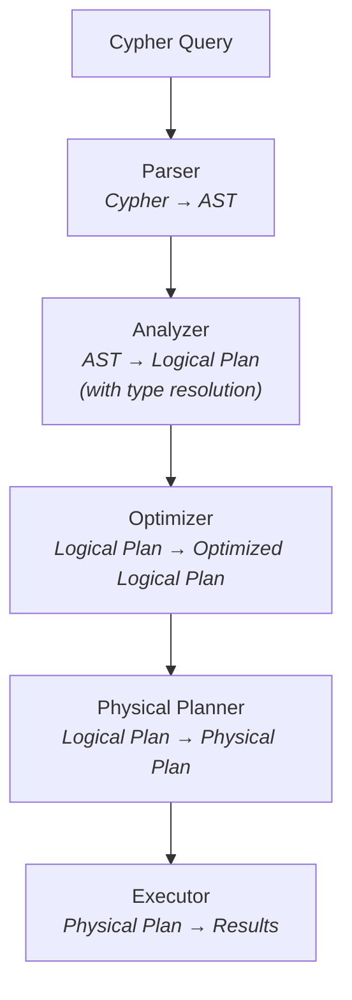

# Query Planning

This document describes how Uni transforms Cypher queries into optimized physical execution plans. The query planner is responsible for parsing, semantic analysis, optimization, and code generation.

## Planning Pipeline Overview



---

## Phase 1: Parsing

The parser transforms Cypher text into an Abstract Syntax Tree (AST).

### Parser Architecture

Uni's parser is built on `sqlparser-rs` with Cypher-specific extensions:

```rust
pub struct CypherParser {
    /// Token stream
    lexer: Lexer,

    /// Current token
    current: Token,

    /// Lookahead token
    peek: Token,
}

impl CypherParser {
    pub fn parse(&mut self) -> Result<Statement> {
        match self.current {
            Token::Match => self.parse_match_clause(),
            Token::Create => self.parse_create_clause(),
            Token::Call => self.parse_call_clause(),
            Token::Return => self.parse_return_clause(),
            _ => Err(UnexpectedToken(self.current)),
        }
    }
}
```

### AST Structure

```rust
pub enum Statement {
    /// READ queries
    Query(QueryStatement),

    /// WRITE queries
    Create(CreateStatement),

    /// DDL
    CreateIndex(CreateIndexStatement),
    DropIndex(String),

    /// Procedures
    Call(CallStatement),
}

pub struct QueryStatement {
    pub match_clause: Option<MatchClause>,
    pub where_clause: Option<Expression>,
    pub with_clause: Option<WithClause>,
    pub return_clause: ReturnClause,
    pub order_by: Option<Vec<OrderByItem>>,
    pub skip: Option<Expression>,
    pub limit: Option<Expression>,
}

pub struct MatchClause {
    pub patterns: Vec<Pattern>,
    pub optional: bool,
}

pub struct Pattern {
    pub elements: Vec<PatternElement>,
}

pub enum PatternElement {
    Node(NodePattern),
    Relationship(RelationshipPattern),
}

pub struct NodePattern {
    pub variable: Option<String>,
    pub labels: Vec<String>,
    pub properties: Option<HashMap<String, Expression>>,
}

pub struct RelationshipPattern {
    pub variable: Option<String>,
    pub types: Vec<String>,
    pub direction: Direction,
    pub properties: Option<HashMap<String, Expression>>,
    pub length: Option<PathLength>,
}
```

### Example Parse

```cypher
MATCH (p:Paper)-[:CITES]->(cited:Paper)
WHERE p.year > 2020
RETURN p.title, cited.title
```

Parses to:

```
QueryStatement {
  match_clause: MatchClause {
    patterns: [
      Pattern {
        elements: [
          Node { variable: "p", labels: ["Paper"], properties: None },
          Relationship { variable: None, types: ["CITES"], direction: Outgoing },
          Node { variable: "cited", labels: ["Paper"], properties: None }
        ]
      }
    ]
  },
  where_clause: BinaryOp {
    left: PropertyAccess { variable: "p", property: "year" },
    op: GreaterThan,
    right: Literal(2020)
  },
  return_clause: ReturnClause {
    items: [
      PropertyAccess { variable: "p", property: "title" },
      PropertyAccess { variable: "cited", property: "title" }
    ]
  }
}
```

---

## Phase 2: Semantic Analysis

The analyzer resolves types, validates schemas, and builds a logical plan.

### Scope Management

```rust
pub struct Analyzer {
    /// Schema for type resolution
    schema: Arc<SchemaManager>,

    /// Variable scope stack
    scopes: Vec<Scope>,
}

pub struct Scope {
    /// Variables in scope: name → (type, label/edge_type)
    variables: HashMap<String, VariableBinding>,
}

pub struct VariableBinding {
    /// Variable type (Node, Relationship, Property)
    var_type: VariableType,

    /// Label ID (for nodes) or edge type ID (for relationships)
    type_id: Option<TypeId>,

    /// Property schema
    properties: Option<Arc<PropertySchema>>,
}

impl Analyzer {
    fn analyze_node_pattern(&mut self, pattern: &NodePattern) -> Result<LogicalNode> {
        // Resolve label to schema
        let label_id = if let Some(label) = pattern.labels.first() {
            Some(self.schema.get_label_id(label)?)
        } else {
            None
        };

        // Register variable in scope
        if let Some(var) = &pattern.variable {
            self.current_scope().bind_variable(
                var.clone(),
                VariableBinding {
                    var_type: VariableType::Node,
                    type_id: label_id.map(TypeId::Label),
                    properties: label_id.and_then(|id| self.schema.get_properties(id)),
                }
            );
        }

        Ok(LogicalNode { label_id, variable: pattern.variable.clone() })
    }
}
```

### Type Inference

```rust
impl Analyzer {
    fn infer_expression_type(&self, expr: &Expression) -> Result<DataType> {
        match expr {
            Expression::Literal(lit) => Ok(lit.data_type()),

            Expression::PropertyAccess { variable, property } => {
                let binding = self.resolve_variable(variable)?;
                let prop_schema = binding.properties
                    .ok_or(UnknownProperty(property.clone()))?;
                prop_schema.get_type(property)
                    .ok_or(UnknownProperty(property.clone()))
            }

            Expression::BinaryOp { left, op, right } => {
                let left_type = self.infer_expression_type(left)?;
                let right_type = self.infer_expression_type(right)?;

                match op {
                    // Comparison operators return boolean
                    Op::Eq | Op::Lt | Op::Gt | Op::Lte | Op::Gte | Op::Neq => {
                        Ok(DataType::Boolean)
                    }
                    // Arithmetic operators preserve type
                    Op::Add | Op::Sub | Op::Mul | Op::Div => {
                        self.common_numeric_type(&left_type, &right_type)
                    }
                    // Boolean operators require boolean
                    Op::And | Op::Or => {
                        if left_type == DataType::Boolean && right_type == DataType::Boolean {
                            Ok(DataType::Boolean)
                        } else {
                            Err(TypeMismatch("boolean", left_type))
                        }
                    }
                }
            }

            Expression::FunctionCall { name, args } => {
                self.infer_function_return_type(name, args)
            }
        }
    }
}
```

---

## Phase 3: Logical Plan

The logical plan represents the query as a tree of relational-style operators.

### Logical Operators

```rust
pub enum LogicalPlan {
    /// Scan vertices of a label
    Scan {
        label_id: LabelId,
        alias: String,
        filter: Option<LogicalExpr>,
    },

    /// Traverse edges
    Traverse {
        input: Box<LogicalPlan>,
        edge_type: EdgeTypeId,
        direction: Direction,
        src_alias: String,
        dst_alias: String,
        edge_alias: Option<String>,
    },

    /// Filter rows
    Filter {
        input: Box<LogicalPlan>,
        predicate: LogicalExpr,
    },

    /// Project columns
    Project {
        input: Box<LogicalPlan>,
        expressions: Vec<(LogicalExpr, String)>,
    },

    /// Aggregate
    Aggregate {
        input: Box<LogicalPlan>,
        group_by: Vec<LogicalExpr>,
        aggregates: Vec<(AggregateFunction, String)>,
    },

    /// Sort
    Sort {
        input: Box<LogicalPlan>,
        order_by: Vec<(LogicalExpr, SortOrder)>,
    },

    /// Limit/Skip
    Limit {
        input: Box<LogicalPlan>,
        skip: Option<usize>,
        limit: Option<usize>,
    },

    /// Vector search
    VectorSearch {
        label_id: LabelId,
        property: String,
        query_vector: Vec<f32>,
        k: usize,
        alias: String,
    },

    /// Cross product (for multiple MATCH patterns)
    CrossProduct {
        left: Box<LogicalPlan>,
        right: Box<LogicalPlan>,
    },
}
```

### Example Logical Plan

Query:
```cypher
MATCH (p:Paper)-[:CITES]->(cited:Paper)
WHERE p.year > 2020
RETURN p.title, COUNT(cited) AS citation_count
ORDER BY citation_count DESC
LIMIT 10
```

Logical Plan:
```
Limit(10)
  └── Sort(citation_count DESC)
        └── Aggregate(GROUP BY p, COUNT(cited))
              └── Filter(p.year > 2020)
                    └── Traverse(CITES, OUT, p → cited)
                          └── Scan(:Paper AS p)
```

---

## Phase 4: Query Optimization

The optimizer applies transformation rules to improve query performance.

### Optimization Rules

```rust
pub trait OptimizationRule {
    /// Rule name for debugging
    fn name(&self) -> &str;

    /// Check if rule applies to this plan
    fn matches(&self, plan: &LogicalPlan) -> bool;

    /// Transform the plan
    fn apply(&self, plan: LogicalPlan) -> LogicalPlan;
}
```

### Rule 1: Predicate Pushdown

Push filters as close to the data source as possible:

```rust
pub struct PredicatePushdown;

impl OptimizationRule for PredicatePushdown {
    fn name(&self) -> &str { "predicate_pushdown" }

    fn apply(&self, plan: LogicalPlan) -> LogicalPlan {
        match plan {
            // Push filter past project
            LogicalPlan::Filter { input, predicate } => {
                match *input {
                    LogicalPlan::Project { input: proj_input, expressions } => {
                        // Check if predicate only references projected columns
                        if can_push_past_project(&predicate, &expressions) {
                            LogicalPlan::Project {
                                input: Box::new(LogicalPlan::Filter {
                                    input: proj_input,
                                    predicate,
                                }),
                                expressions,
                            }
                        } else {
                            // Can't push, keep original
                            LogicalPlan::Filter {
                                input: Box::new(LogicalPlan::Project {
                                    input: proj_input,
                                    expressions,
                                }),
                                predicate,
                            }
                        }
                    }

                    // Push filter past traverse (for source-side predicates)
                    LogicalPlan::Traverse { input, edge_type, direction, src_alias, dst_alias, edge_alias } => {
                        let (src_predicates, other_predicates) = split_predicates(&predicate, &src_alias);

                        let new_input = if !src_predicates.is_empty() {
                            Box::new(LogicalPlan::Filter {
                                input,
                                predicate: conjoin(src_predicates),
                            })
                        } else {
                            input
                        };

                        let traverse = LogicalPlan::Traverse {
                            input: new_input,
                            edge_type, direction, src_alias, dst_alias, edge_alias,
                        };

                        if !other_predicates.is_empty() {
                            LogicalPlan::Filter {
                                input: Box::new(traverse),
                                predicate: conjoin(other_predicates),
                            }
                        } else {
                            traverse
                        }
                    }

                    _ => LogicalPlan::Filter { input, predicate }
                }
            }
            _ => plan
        }
    }
}
```

**Before:**
```
Filter(p.year > 2020 AND cited.venue = 'NeurIPS')
  └── Traverse(CITES, p → cited)
        └── Scan(:Paper AS p)
```

**After:**
```
Filter(cited.venue = 'NeurIPS')
  └── Traverse(CITES, p → cited)
        └── Filter(p.year > 2020)
              └── Scan(:Paper AS p)
```

### Rule 2: Projection Pushdown

Only load columns that are actually used:

```rust
pub struct ProjectionPushdown;

impl OptimizationRule for ProjectionPushdown {
    fn apply(&self, plan: LogicalPlan) -> LogicalPlan {
        // Collect all referenced columns
        let required_columns = collect_required_columns(&plan);

        // Push minimal projections to scans
        self.push_projections(plan, &required_columns)
    }

    fn push_projections(&self, plan: LogicalPlan, required: &HashSet<Column>) -> LogicalPlan {
        match plan {
            LogicalPlan::Scan { label_id, alias, filter } => {
                // Only scan required columns + filter columns
                let scan_columns: Vec<String> = required
                    .iter()
                    .filter(|c| c.table == alias)
                    .map(|c| c.column.clone())
                    .collect();

                LogicalPlan::Scan {
                    label_id,
                    alias,
                    filter,
                    columns: Some(scan_columns),  // Add projection
                }
            }
            // ... recurse through other operators
            _ => plan
        }
    }
}
```

### Rule 3: Scan-to-Index

Replace scans with index lookups when possible:

```rust
pub struct ScanToIndex {
    index_catalog: Arc<IndexCatalog>,
}

impl OptimizationRule for ScanToIndex {
    fn apply(&self, plan: LogicalPlan) -> LogicalPlan {
        match plan {
            LogicalPlan::Filter { input, predicate } => {
                if let LogicalPlan::Scan { label_id, alias, .. } = *input {
                    // Check if predicate can use an index
                    if let Some(index) = self.find_applicable_index(label_id, &predicate) {
                        return LogicalPlan::IndexScan {
                            label_id,
                            alias,
                            index_id: index.id,
                            bounds: self.extract_bounds(&predicate, &index),
                        };
                    }
                }

                LogicalPlan::Filter { input, predicate }
            }
            _ => plan
        }
    }
}
```

### Rule 4: Limit Pushdown

Push LIMIT to reduce work early:

```rust
pub struct LimitPushdown;

impl OptimizationRule for LimitPushdown {
    fn apply(&self, plan: LogicalPlan) -> LogicalPlan {
        match plan {
            // Push limit past filter (filter doesn't increase rows)
            LogicalPlan::Limit { input, skip, limit } => {
                match *input {
                    LogicalPlan::Filter { input: filter_input, predicate } => {
                        LogicalPlan::Filter {
                            input: Box::new(LogicalPlan::Limit {
                                input: filter_input,
                                skip,
                                limit: limit.map(|l| l * 2), // Over-fetch for safety
                            }),
                            predicate,
                        }
                    }
                    _ => LogicalPlan::Limit { input, skip, limit }
                }
            }
            _ => plan
        }
    }
}
```

### Rule 5: Join Reordering

For multiple MATCH patterns, choose optimal join order:

```rust
pub struct JoinReorder;

impl OptimizationRule for JoinReorder {
    fn apply(&self, plan: LogicalPlan) -> LogicalPlan {
        match plan {
            LogicalPlan::CrossProduct { left, right } => {
                // Estimate cardinalities
                let left_card = self.estimate_cardinality(&left);
                let right_card = self.estimate_cardinality(&right);

                // Smaller relation on left (build side for hash join)
                if left_card > right_card {
                    LogicalPlan::CrossProduct {
                        left: right,
                        right: left,
                    }
                } else {
                    LogicalPlan::CrossProduct { left, right }
                }
            }
            _ => plan
        }
    }
}
```

### Optimizer Pipeline

```rust
pub struct QueryOptimizer {
    rules: Vec<Box<dyn OptimizationRule>>,
}

impl QueryOptimizer {
    pub fn new() -> Self {
        Self {
            rules: vec![
                Box::new(PredicatePushdown),
                Box::new(ProjectionPushdown),
                Box::new(ScanToIndex::new()),
                Box::new(LimitPushdown),
                Box::new(JoinReorder),
            ],
        }
    }

    pub fn optimize(&self, plan: LogicalPlan) -> LogicalPlan {
        let mut current = plan;

        // Fixed-point iteration
        loop {
            let mut changed = false;

            for rule in &self.rules {
                let new_plan = self.apply_rule_recursive(rule.as_ref(), current.clone());
                if new_plan != current {
                    changed = true;
                    current = new_plan;
                }
            }

            if !changed {
                break;
            }
        }

        current
    }
}
```

---

## Phase 5: Physical Planning

Convert logical operators to physical operators with specific algorithms.

### Physical Operators

```rust
pub enum PhysicalPlan {
    /// Scan from Lance with pushdown
    LanceScan {
        dataset_id: DatasetId,
        projection: Vec<String>,
        filter: Option<LanceFilter>,
        batch_size: usize,
    },

    /// Index-based scan
    IndexScan {
        index_id: IndexId,
        bounds: IndexBounds,
        projection: Vec<String>,
    },

    /// Vector similarity search
    VectorScan {
        index_id: IndexId,
        query_vector: Vec<f32>,
        k: usize,
        ef_search: usize,
    },

    /// Traverse using adjacency cache
    CsrTraverse {
        input: Box<PhysicalPlan>,
        edge_type: EdgeTypeId,
        direction: Direction,
        cache: Arc<AdjacencyCache>,
    },

    /// Filter with vectorized predicate
    VectorizedFilter {
        input: Box<PhysicalPlan>,
        predicate: PhysicalExpr,
    },

    /// Hash-based aggregation
    HashAggregate {
        input: Box<PhysicalPlan>,
        group_by: Vec<PhysicalExpr>,
        aggregates: Vec<PhysicalAggregateExpr>,
    },

    /// External merge sort
    MergeSort {
        input: Box<PhysicalPlan>,
        order_by: Vec<(PhysicalExpr, SortOrder)>,
        memory_limit: usize,
    },

    /// Stream limit
    StreamLimit {
        input: Box<PhysicalPlan>,
        skip: usize,
        limit: usize,
    },

    /// Late property materialization
    LateMaterialize {
        input: Box<PhysicalPlan>,
        columns: Vec<String>,
        prop_manager: Arc<PropertyManager>,
    },

    /// Exchange for parallelism
    Exchange {
        input: Box<PhysicalPlan>,
        partitioning: Partitioning,
    },
}
```

### Physical Planning Decisions

```rust
pub struct PhysicalPlanner {
    storage: Arc<StorageManager>,
    config: PlannerConfig,
}

impl PhysicalPlanner {
    pub fn plan(&self, logical: LogicalPlan) -> PhysicalPlan {
        match logical {
            LogicalPlan::Scan { label_id, alias, filter, columns } => {
                let dataset_id = self.storage.dataset_for_label(label_id);

                // Decide: full scan vs index scan
                if let Some(index) = self.find_best_index(&filter) {
                    PhysicalPlan::IndexScan {
                        index_id: index.id,
                        bounds: self.extract_bounds(&filter, &index),
                        projection: columns.unwrap_or_default(),
                    }
                } else {
                    PhysicalPlan::LanceScan {
                        dataset_id,
                        projection: columns.unwrap_or_default(),
                        filter: filter.map(|f| self.to_lance_filter(f)),
                        batch_size: self.config.batch_size,
                    }
                }
            }

            LogicalPlan::Traverse { input, edge_type, direction, .. } => {
                PhysicalPlan::CsrTraverse {
                    input: Box::new(self.plan(*input)),
                    edge_type,
                    direction,
                    cache: self.storage.adjacency_cache(),
                }
            }

            LogicalPlan::Aggregate { input, group_by, aggregates } => {
                // Estimate input cardinality for algorithm selection
                let input_card = self.estimate_cardinality(&input);
                let group_card = self.estimate_group_cardinality(&group_by, input_card);

                if group_card < self.config.hash_agg_threshold {
                    // In-memory hash aggregation
                    PhysicalPlan::HashAggregate {
                        input: Box::new(self.plan(*input)),
                        group_by: group_by.into_iter().map(|e| self.to_physical(e)).collect(),
                        aggregates: aggregates.into_iter().map(|a| self.to_physical_agg(a)).collect(),
                    }
                } else {
                    // Sort-based aggregation for large groups
                    PhysicalPlan::SortAggregate {
                        input: Box::new(PhysicalPlan::MergeSort {
                            input: Box::new(self.plan(*input)),
                            order_by: group_by.iter().map(|e| (self.to_physical(e.clone()), SortOrder::Asc)).collect(),
                            memory_limit: self.config.sort_memory_limit,
                        }),
                        group_by: group_by.into_iter().map(|e| self.to_physical(e)).collect(),
                        aggregates: aggregates.into_iter().map(|a| self.to_physical_agg(a)).collect(),
                    }
                }
            }

            LogicalPlan::Sort { input, order_by } => {
                let input_plan = self.plan(*input);

                // Check if input is already sorted
                if self.is_sorted(&input_plan, &order_by) {
                    input_plan
                } else {
                    PhysicalPlan::MergeSort {
                        input: Box::new(input_plan),
                        order_by: order_by.into_iter()
                            .map(|(e, ord)| (self.to_physical(e), ord))
                            .collect(),
                        memory_limit: self.config.sort_memory_limit,
                    }
                }
            }

            // ... other operators
        }
    }
}
```

---

## Cost Estimation

The optimizer uses cost estimates to choose between plans.

### Statistics

```rust
pub struct TableStatistics {
    /// Total row count
    pub row_count: u64,

    /// Size in bytes
    pub size_bytes: u64,

    /// Per-column statistics
    pub column_stats: HashMap<String, ColumnStatistics>,
}

pub struct ColumnStatistics {
    /// Distinct value count
    pub distinct_count: u64,

    /// Null count
    pub null_count: u64,

    /// Min/max values (if orderable)
    pub min: Option<ScalarValue>,
    pub max: Option<ScalarValue>,

    /// Histogram buckets (optional)
    pub histogram: Option<Histogram>,
}
```

### Cost Model

```rust
pub struct CostEstimator {
    stats_cache: Arc<StatisticsCache>,
}

impl CostEstimator {
    pub fn estimate_cost(&self, plan: &LogicalPlan) -> Cost {
        match plan {
            LogicalPlan::Scan { label_id, filter, .. } => {
                let stats = self.stats_cache.get_table_stats(*label_id);
                let selectivity = filter
                    .as_ref()
                    .map(|f| self.estimate_selectivity(f, &stats))
                    .unwrap_or(1.0);

                Cost {
                    rows: (stats.row_count as f64 * selectivity) as u64,
                    cpu: stats.row_count,  // CPU cost proportional to rows scanned
                    io: stats.size_bytes,  // I/O cost = bytes read
                }
            }

            LogicalPlan::IndexScan { index_id, bounds, .. } => {
                let index_stats = self.stats_cache.get_index_stats(*index_id);
                let selectivity = self.estimate_range_selectivity(bounds, &index_stats);

                Cost {
                    rows: (index_stats.total_rows as f64 * selectivity) as u64,
                    cpu: 100,  // Index lookup is cheap
                    io: 1000,  // Small I/O for index
                }
            }

            LogicalPlan::Traverse { input, edge_type, .. } => {
                let input_cost = self.estimate_cost(input);
                let avg_degree = self.stats_cache.get_avg_degree(*edge_type);

                Cost {
                    rows: input_cost.rows * avg_degree as u64,
                    cpu: input_cost.cpu + input_cost.rows * 10,  // Adjacency lookup
                    io: input_cost.io,  // Adjacency is cached
                }
            }

            LogicalPlan::HashAggregate { input, group_by, .. } => {
                let input_cost = self.estimate_cost(input);
                let group_card = self.estimate_group_cardinality(group_by, input_cost.rows);

                Cost {
                    rows: group_card,
                    cpu: input_cost.cpu + input_cost.rows * 50,  // Hash + aggregate
                    io: input_cost.io,
                }
            }

            // ... other operators
        }
    }

    fn estimate_selectivity(&self, predicate: &LogicalExpr, stats: &TableStatistics) -> f64 {
        match predicate {
            LogicalExpr::Comparison { left, op, right } => {
                if let LogicalExpr::Column(col) = left.as_ref() {
                    if let Some(col_stats) = stats.column_stats.get(col) {
                        match op {
                            Op::Eq => 1.0 / col_stats.distinct_count as f64,
                            Op::Lt | Op::Gt => 0.3,  // Assume 30% selectivity
                            Op::Lte | Op::Gte => 0.33,
                            Op::Neq => 1.0 - (1.0 / col_stats.distinct_count as f64),
                        }
                    } else {
                        0.5  // Default
                    }
                } else {
                    0.5
                }
            }

            LogicalExpr::And(left, right) => {
                self.estimate_selectivity(left, stats) * self.estimate_selectivity(right, stats)
            }

            LogicalExpr::Or(left, right) => {
                let s1 = self.estimate_selectivity(left, stats);
                let s2 = self.estimate_selectivity(right, stats);
                s1 + s2 - (s1 * s2)  // Union formula
            }

            _ => 0.5
        }
    }
}
```

---

## EXPLAIN Output

Use EXPLAIN to view query plans:

```bash
uni query "EXPLAIN MATCH (p:Paper) WHERE p.year > 2020 RETURN p.title" --path ./storage
```

**Output:**
```
Query Plan:
═══════════════════════════════════════════════════════════════════════════════

Logical Plan:
├── Project [p.title]
│     └── Filter [p.year > 2020]
│           └── Scan [:Paper AS p]

Physical Plan:
├── VectorizedProject [p.title]
│     └── LateMaterialize [title]
│           └── LanceScan [:Paper]
│                 ├── Projection: [_vid, year]
│                 ├── Pushdown: year > 2020
│                 └── Index: paper_year (BTree)

Statistics:
├── Estimated rows: 5,000 (50% selectivity)
├── Estimated I/O: 2.5 MB
└── Index usage: paper_year

═══════════════════════════════════════════════════════════════════════════════
```

---

## Configuration

```rust
pub struct PlannerConfig {
    /// Batch size for vectorized execution
    pub batch_size: usize,  // Default: 4096

    /// Memory limit for sort operators
    pub sort_memory_limit: usize,  // Default: 256 MB

    /// Threshold for hash vs sort aggregation
    pub hash_agg_threshold: u64,  // Default: 1_000_000

    /// Enable predicate pushdown
    pub enable_pushdown: bool,  // Default: true

    /// Enable late materialization
    pub enable_late_materialize: bool,  // Default: true

    /// Maximum optimization iterations
    pub max_optimization_rounds: usize,  // Default: 10
}
```

---

## Next Steps

- [Vectorized Execution](vectorized-execution.md) — How physical plans execute
- [Storage Engine](storage-engine.md) — Data persistence layer
- [Benchmarks](benchmarks.md) — Query performance measurements
