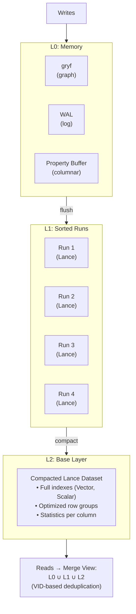
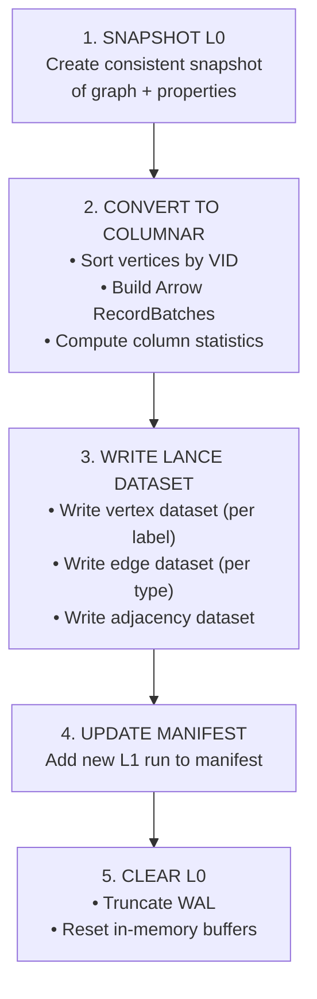
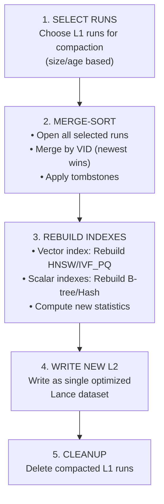

# Storage Engine Internals

Uni's storage engine is architected for high-throughput ingestion and low-latency analytics, leveraging a tiered LSM-tree-like structure backed by **Lance** columnar format. This design enables both OLTP-style writes and OLAP-style analytical queries on the same data.

## Architecture Overview



---

## Tiered Storage Model

### L0: Memory Buffer

The L0 layer handles all incoming writes with maximum throughput.

```rust
pub struct L0Buffer {
    /// In-memory graph structure (vertices + edges)
    graph: gryf::Graph<VertexData, EdgeData>,

    /// Property storage (columnar)
    properties: HashMap<LabelId, ArrowPropertyBuffer>,

    /// Write-ahead log reference
    wal: Arc<Wal>,

    /// Mutation counter for flush triggering
    mutation_count: AtomicUsize,

    /// Size estimate in bytes
    estimated_size: AtomicUsize,
}

pub struct ArrowPropertyBuffer {
    /// Schema for this label's properties
    schema: Arc<Schema>,

    /// Column builders (one per property)
    builders: Vec<Box<dyn ArrayBuilder>>,

    /// VID to row index mapping
    vid_to_row: HashMap<Vid, usize>,
}
```

**Characteristics:**

| Property | Value | Notes |
|----------|-------|-------|
| Format | gryf + Arrow builders | Row-oriented for inserts |
| Durability | WAL-backed | Survives crashes |
| Latency | ~550µs per 1K writes | Memory-speed |
| Capacity | Configurable (default 128MB) | Auto-flush when full |

**Write Path:**

```
1. Acquire write lock (single-writer)
2. Append to WAL (sync or async based on config)
3. Insert into gryf graph (vertex/edge)
4. Append properties to Arrow builders
5. Increment mutation counter
6. If threshold reached → trigger async flush
```

### L1: Sorted Runs

When L0 fills up, it flushes to L1 as an immutable Lance dataset.

```rust
pub struct L1Run {
    /// Lance dataset for this run
    dataset: Dataset,

    /// VID range covered
    vid_range: Range<Vid>,

    /// Creation timestamp
    created_at: Timestamp,

    /// Run sequence number
    sequence: u64,
}

pub struct L1Manager {
    /// Active runs (newest first)
    runs: Vec<L1Run>,

    /// Maximum runs before compaction
    max_runs: usize,

    /// Compaction threshold (bytes)
    compaction_threshold: usize,
}
```

**Flush Process:**



### L2: Base Layer

The L2 layer contains fully compacted, indexed data.

```rust
pub struct L2Layer {
    /// Main vertex dataset (per label)
    vertex_datasets: HashMap<LabelId, Dataset>,

    /// Main edge dataset (per type)
    edge_datasets: HashMap<EdgeTypeId, Dataset>,

    /// Adjacency datasets (per edge type + direction)
    adjacency_datasets: HashMap<(EdgeTypeId, Direction), Dataset>,

    /// Vector indexes
    vector_indexes: HashMap<IndexId, VectorIndex>,

    /// Scalar indexes
    scalar_indexes: HashMap<IndexId, ScalarIndex>,
}
```

**Compaction Process:**



---

## Lance Integration

Uni uses [Lance](https://lancedb.github.io/lance/) as its core columnar format.

### Why Lance?

| Feature | Benefit |
|---------|---------|
| **Native Vector Support** | Built-in HNSW, IVF_PQ indexes |
| **Versioning** | Time-travel, ACID transactions |
| **Fast Random Access** | O(1) row lookup by index |
| **Columnar Scans** | Efficient analytical queries |
| **Object Store Native** | S3/GCS support built-in |
| **Zero-Copy** | Arrow-compatible memory layout |

### Lance File Format

```
Lance Dataset Structure:

data/
├── _versions/                    # Version metadata
│   ├── 1.manifest               # Version 1 manifest
│   ├── 2.manifest               # Version 2 manifest
│   └── ...
├── _indices/                     # Index data
│   ├── vector_idx_001/          # Vector index
│   │   ├── index.idx
│   │   └── ...
│   └── scalar_idx_002/          # Scalar index
└── data/                         # Column data
    ├── part-0.lance              # Data fragment
    ├── part-1.lance
    └── ...
```

### Data Fragment Structure

```rust
pub struct LanceFragment {
    /// Fragment ID
    id: u64,

    /// Row range in this fragment
    row_range: Range<u64>,

    /// Physical files for each column
    columns: HashMap<String, ColumnFiles>,

    /// Fragment-level statistics
    stats: FragmentStatistics,
}

pub struct FragmentStatistics {
    /// Row count
    num_rows: u64,

    /// Per-column statistics
    column_stats: HashMap<String, ColumnStats>,
}

pub struct ColumnStats {
    null_count: u64,
    min_value: Option<ScalarValue>,
    max_value: Option<ScalarValue>,
    distinct_count: Option<u64>,
}
```

---

## Dataset Organization

### Vertex Datasets

One Lance dataset per vertex label:

```
storage/
├── vertices/
│   ├── Paper/                    # :Paper vertices
│   │   ├── _versions/
│   │   ├── _indices/
│   │   │   ├── embedding_hnsw/   # Vector index
│   │   │   └── year_btree/       # Scalar index
│   │   └── data/
│   ├── Author/                   # :Author vertices
│   │   └── ...
│   └── Venue/                    # :Venue vertices
│       └── ...
```

**Vertex Schema:**

```
┌─────────────────────────────────────────────────────────────────────────────┐
│                           VERTEX DATASET SCHEMA                              │
├─────────────────────────────────────────────────────────────────────────────┤
│                                                                             │
│   System Columns:                                                           │
│   ┌──────────┬──────────┬────────────────────────────────────────────────┐ │
│   │ Column   │ Type     │ Description                                    │ │
│   ├──────────┼──────────┼────────────────────────────────────────────────┤ │
│   │ _vid     │ UInt64   │ Internal vertex ID (label << 48 | offset)     │ │
│   │ _uid     │ Binary   │ UniId (32-byte SHA3-256) - optional        │ │
│   │ _ext_id  │ String   │ External ID from source system                │ │
│   │ _deleted │ Bool     │ Tombstone marker (soft delete)                │ │
│   │ _version │ UInt64   │ Last modified version                         │ │
│   └──────────┴──────────┴────────────────────────────────────────────────┘ │
│                                                                             │
│   User Properties (schema-defined):                                         │
│   ┌──────────┬──────────┬────────────────────────────────────────────────┐ │
│   │ title    │ String   │ Paper title                                    │ │
│   │ year     │ Int32    │ Publication year                               │ │
│   │ abstract │ String   │ Paper abstract (nullable)                      │ │
│   │ embedding│ Vector   │ 768-dimensional embedding                      │ │
│   │ _doc     │ Json     │ Document mode flexible fields                  │ │
│   └──────────┴──────────┴────────────────────────────────────────────────┘ │
│                                                                             │
└─────────────────────────────────────────────────────────────────────────────┘
```

### Edge Datasets

One Lance dataset per edge type:

```
storage/
├── edges/
│   ├── CITES/                    # :CITES edges
│   │   └── ...
│   ├── AUTHORED_BY/              # :AUTHORED_BY edges
│   │   └── ...
│   └── PUBLISHED_IN/
│       └── ...
```

**Edge Schema:**

```
┌─────────────────────────────────────────────────────────────────────────────┐
│                            EDGE DATASET SCHEMA                               │
├─────────────────────────────────────────────────────────────────────────────┤
│                                                                             │
│   System Columns:                                                           │
│   ┌──────────┬──────────┬────────────────────────────────────────────────┐ │
│   │ Column   │ Type     │ Description                                    │ │
│   ├──────────┼──────────┼────────────────────────────────────────────────┤ │
│   │ _eid     │ UInt64   │ Internal edge ID (type << 48 | offset)        │ │
│   │ _src_vid │ UInt64   │ Source vertex VID                              │ │
│   │ _dst_vid │ UInt64   │ Destination vertex VID                         │ │
│   │ _deleted │ Bool     │ Tombstone marker                               │ │
│   │ _version │ UInt64   │ Last modified version                          │ │
│   └──────────┴──────────┴────────────────────────────────────────────────┘ │
│                                                                             │
│   Edge Properties (schema-defined):                                         │
│   ┌──────────┬──────────┬────────────────────────────────────────────────┐ │
│   │ weight   │ Float64  │ Edge weight/score                              │ │
│   │ position │ Int32    │ Author position (for AUTHORED_BY)              │ │
│   │ timestamp│ Timestamp│ When the edge was created                      │ │
│   └──────────┴──────────┴────────────────────────────────────────────────┘ │
│                                                                             │
└─────────────────────────────────────────────────────────────────────────────┘
```

### Adjacency Datasets

Optimized for graph traversal (CSR-style):

```
storage/
├── adjacency/
│   ├── CITES_OUT/                # Outgoing CITES edges
│   │   └── ...
│   ├── CITES_IN/                 # Incoming CITES edges (reverse)
│   │   └── ...
│   └── ...
```

**Adjacency Schema:**

```
┌─────────────────────────────────────────────────────────────────────────────┐
│                         ADJACENCY DATASET SCHEMA                             │
├─────────────────────────────────────────────────────────────────────────────┤
│                                                                             │
│   Chunked CSR Format (one row per chunk of vertices):                       │
│   ┌─────────────┬──────────────┬────────────────────────────────────────┐  │
│   │ Column      │ Type         │ Description                            │  │
│   ├─────────────┼──────────────┼────────────────────────────────────────┤  │
│   │ chunk_id    │ UInt64       │ Chunk identifier                       │  │
│   │ vid_start   │ UInt64       │ First VID in chunk                     │  │
│   │ vid_end     │ UInt64       │ Last VID in chunk (exclusive)          │  │
│   │ offsets     │ List<UInt64> │ CSR offsets (chunk_size + 1 elements)  │  │
│   │ neighbors   │ List<UInt64> │ Neighbor VIDs (flattened)              │  │
│   │ edge_ids    │ List<UInt64> │ Edge IDs (parallel to neighbors)       │  │
│   └─────────────┴──────────────┴────────────────────────────────────────┘  │
│                                                                             │
│   Example (chunk_size=1000):                                                │
│   ┌────────────────────────────────────────────────────────────────────┐   │
│   │ chunk_id: 0                                                         │   │
│   │ vid_start: 0, vid_end: 1000                                         │   │
│   │ offsets: [0, 3, 3, 7, 10, ...]  (1001 elements)                     │   │
│   │ neighbors: [v5, v12, v99, v4, v6, v8, v42, ...]                     │   │
│   │ edge_ids: [e1, e2, e3, e4, e5, e6, e7, ...]                         │   │
│   └────────────────────────────────────────────────────────────────────┘   │
│                                                                             │
└─────────────────────────────────────────────────────────────────────────────┘
```

---

## Write-Ahead Log (WAL)

The WAL ensures durability for uncommitted L0 data.

### WAL Structure

```rust
pub struct Wal {
    /// Active segment being written
    active_segment: Mutex<WalSegment>,

    /// Completed segments awaiting flush
    sealed_segments: Vec<WalSegment>,

    /// Configuration
    config: WalConfig,
}

pub struct WalSegment {
    /// Segment file
    file: File,

    /// Segment sequence number
    sequence: u64,

    /// Current size
    size: usize,
}

pub struct WalConfig {
    /// Segment size before rotation
    max_segment_size: usize,  // Default: 64 MB

    /// Sync mode
    sync_mode: WalSyncMode,

    /// Directory for WAL files
    wal_dir: PathBuf,
}

pub enum WalSyncMode {
    /// fsync after every write (safest, slowest)
    Sync,

    /// fsync periodically (balanced)
    Periodic { interval_ms: u64 },

    /// OS-managed sync (fastest, risk of data loss)
    Async,
}
```

### WAL Entry Format

```
┌─────────────────────────────────────────────────────────────────────────────┐
│                            WAL ENTRY FORMAT                                  │
├─────────────────────────────────────────────────────────────────────────────┤
│                                                                             │
│   ┌──────────┬──────────┬──────────┬──────────┬────────────────────────┐   │
│   │  Length  │   CRC    │   Type   │  Flags   │        Payload         │   │
│   │  4 bytes │  4 bytes │  1 byte  │  1 byte  │      variable          │   │
│   └──────────┴──────────┴──────────┴──────────┴────────────────────────┘   │
│                                                                             │
│   Entry Types:                                                              │
│   ┌──────────┬───────────────────────────────────────────────────────────┐ │
│   │ 0x01     │ InsertVertex { vid, label_id, properties }                │ │
│   │ 0x02     │ InsertEdge { eid, src_vid, dst_vid, type_id, properties } │ │
│   │ 0x03     │ DeleteVertex { vid }                                      │ │
│   │ 0x04     │ DeleteEdge { eid }                                        │ │
│   │ 0x05     │ UpdateProperties { vid, properties }                      │ │
│   │ 0xFF     │ Checkpoint { sequence, timestamp }                        │ │
│   └──────────┴───────────────────────────────────────────────────────────┘ │
│                                                                             │
└─────────────────────────────────────────────────────────────────────────────┘
```

### Recovery Process

```rust
impl Wal {
    pub async fn recover(&self, l0: &mut L0Buffer) -> Result<()> {
        // Find all WAL segments
        let segments = self.list_segments()?;

        for segment in segments {
            let reader = WalReader::open(&segment)?;

            while let Some(entry) = reader.next_entry()? {
                // Verify CRC
                if !entry.verify_crc() {
                    // Truncate at corruption point
                    break;
                }

                // Replay entry
                match entry.entry_type {
                    EntryType::InsertVertex { vid, label_id, props } => {
                        l0.insert_vertex(vid, label_id, props)?;
                    }
                    EntryType::InsertEdge { eid, src, dst, type_id, props } => {
                        l0.insert_edge(eid, src, dst, type_id, props)?;
                    }
                    // ... handle other types
                }
            }
        }

        Ok(())
    }
}
```

---

## Snapshot Management

Snapshots provide consistent point-in-time views.

### Manifest Structure

```json
{
  "version": 42,
  "timestamp": "2024-01-15T10:30:00Z",
  "schema_version": 1,

  "vertex_datasets": {
    "Paper": {
      "lance_version": 15,
      "row_count": 1000000,
      "size_bytes": 524288000
    },
    "Author": {
      "lance_version": 8,
      "row_count": 250000,
      "size_bytes": 62500000
    }
  },

  "edge_datasets": {
    "CITES": {
      "lance_version": 12,
      "row_count": 5000000,
      "size_bytes": 200000000
    }
  },

  "adjacency_datasets": {
    "CITES_OUT": { "lance_version": 12 },
    "CITES_IN": { "lance_version": 12 }
  },

  "l1_runs": [
    { "sequence": 100, "created_at": "2024-01-15T10:25:00Z" },
    { "sequence": 101, "created_at": "2024-01-15T10:28:00Z" }
  ],

  "indexes": {
    "paper_embeddings": {
      "type": "hnsw",
      "version": 5,
      "row_count": 1000000
    },
    "paper_year": {
      "type": "btree",
      "version": 3
    }
  }
}
```

### Snapshot Operations

```rust
impl StorageManager {
    /// Create a new snapshot (after flush)
    pub async fn create_snapshot(&self) -> Result<Snapshot> {
        let manifest = Manifest {
            version: self.next_version(),
            timestamp: Utc::now(),
            vertex_datasets: self.collect_vertex_versions(),
            edge_datasets: self.collect_edge_versions(),
            adjacency_datasets: self.collect_adjacency_versions(),
            l1_runs: self.l1_manager.list_runs(),
            indexes: self.collect_index_versions(),
        };

        // Write manifest atomically
        self.write_manifest(&manifest).await?;

        Ok(Snapshot::new(manifest))
    }

    /// Open a specific snapshot for reading
    pub async fn open_snapshot(&self, version: u64) -> Result<SnapshotReader> {
        let manifest = self.read_manifest(version).await?;

        Ok(SnapshotReader {
            manifest,
            vertex_readers: self.open_vertex_readers(&manifest).await?,
            edge_readers: self.open_edge_readers(&manifest).await?,
            adjacency_cache: self.load_adjacency(&manifest).await?,
        })
    }
}
```

---

## Index Storage

### Vector Index Storage

Vector indexes (HNSW, IVF_PQ) are stored within Lance datasets:

```rust
pub struct VectorIndexStorage {
    /// Lance dataset with index
    dataset: Dataset,

    /// Index configuration
    config: VectorIndexConfig,
}

impl VectorIndexStorage {
    pub async fn create_index(
        dataset: &mut Dataset,
        column: &str,
        config: VectorIndexConfig,
    ) -> Result<()> {
        match config.index_type {
            IndexType::Hnsw => {
                dataset.create_index()
                    .column(column)
                    .index_type("IVF_HNSW_SQ")
                    .metric_type(config.metric.to_lance())
                    .build()
                    .await?;
            }
            IndexType::IvfPq => {
                dataset.create_index()
                    .column(column)
                    .index_type("IVF_PQ")
                    .metric_type(config.metric.to_lance())
                    .num_partitions(config.num_partitions)
                    .num_sub_vectors(config.num_sub_vectors)
                    .build()
                    .await?;
            }
        }

        Ok(())
    }
}
```

### Scalar Index Storage

Scalar indexes use Lance's built-in index support:

```rust
pub struct ScalarIndexStorage {
    /// Index metadata
    metadata: ScalarIndexMetadata,
}

impl ScalarIndexStorage {
    pub async fn create_index(
        dataset: &mut Dataset,
        column: &str,
        index_type: ScalarIndexType,
    ) -> Result<()> {
        dataset.create_index()
            .column(column)
            .index_type(match index_type {
                ScalarIndexType::BTree => "BTREE",
                ScalarIndexType::Hash => "HASH",
                ScalarIndexType::Bitmap => "BITMAP",
            })
            .build()
            .await?;

        Ok(())
    }
}
```

---

## Object Store Integration

Uni supports multiple storage backends through `object_store`:

### Supported Backends

| Backend | URI Scheme | Notes |
|---------|------------|-------|
| Local filesystem | `file://` | Default, development |
| Amazon S3 | `s3://` | Production, scalable |
| Google Cloud Storage | `gs://` | Production, scalable |
| Azure Blob Storage | `az://` | Production |
| Memory | `memory://` | Testing only |

### Configuration

```rust
pub struct ObjectStoreConfig {
    /// Base URI (e.g., "s3://bucket/path")
    uri: String,

    /// AWS/GCP credentials
    credentials: Option<Credentials>,

    /// Connection settings
    max_connections: usize,
    connect_timeout: Duration,
    read_timeout: Duration,

    /// Retry configuration
    retry_config: RetryConfig,
}

impl StorageManager {
    pub fn new_with_object_store(
        uri: &str,
        schema_manager: Arc<SchemaManager>,
        config: ObjectStoreConfig,
    ) -> Result<Self> {
        let object_store = match uri {
            s if s.starts_with("s3://") => {
                AmazonS3Builder::from_env()
                    .with_url(uri)
                    .with_max_connections(config.max_connections)
                    .build()?
            }
            s if s.starts_with("gs://") => {
                GoogleCloudStorageBuilder::from_env()
                    .with_url(uri)
                    .build()?
            }
            s if s.starts_with("file://") || !s.contains("://") => {
                LocalFileSystem::new_with_prefix(uri)?
            }
            _ => return Err(UnsupportedBackend(uri.to_string())),
        };

        // Initialize Lance with object store
        let lance_config = LanceConfig::new(object_store);

        Ok(Self::new_with_lance(lance_config, schema_manager))
    }
}
```

### Local Caching

For remote object stores, local caching improves performance:

```rust
pub struct CachedObjectStore {
    /// Remote object store
    remote: Arc<dyn ObjectStore>,

    /// Local cache directory
    cache_dir: PathBuf,

    /// Maximum cache size
    max_size: usize,

    /// LRU eviction
    lru: LruCache<Path, CacheEntry>,
}

impl CachedObjectStore {
    pub async fn get(&self, path: &Path) -> Result<Bytes> {
        // Check local cache first
        if let Some(entry) = self.lru.get(path) {
            return Ok(entry.data.clone());
        }

        // Fetch from remote
        let data = self.remote.get(path).await?.bytes().await?;

        // Cache locally
        self.cache_locally(path, &data).await?;

        Ok(data)
    }
}
```

---

## Performance Characteristics

### Write Performance

| Operation | Latency | Throughput | Notes |
|-----------|---------|------------|-------|
| L0 insert (vertex) | ~50µs | ~20K/sec | Memory only |
| L0 insert (edge) | ~30µs | ~33K/sec | Memory only |
| L0 batch insert (1K) | ~550µs | ~1.8M/sec | Amortized |
| L0 → L1 flush | ~6ms/1K | - | Lance write |
| L1 → L2 compact | ~1s/100K | - | Background |

### Read Performance

| Operation | Latency | Notes |
|-----------|---------|-------|
| Point lookup (indexed) | ~2.9ms | Hash index |
| Range scan (indexed) | ~5ms + 0.1ms/row | B-tree index |
| Full scan | ~50ms/100K rows | Columnar |
| Vector KNN (k=10) | ~1.8ms | HNSW index |

### Storage Efficiency

| Data Type | Compression | Ratio |
|-----------|-------------|-------|
| Integers | Dictionary + RLE | 5-20x |
| Strings | Dictionary + LZ4 | 3-10x |
| Vectors | No compression | 1x |
| Booleans | Bitmap | 8x |

---

## Configuration Reference

```rust
pub struct StorageConfig {
    // L0 Configuration
    /// Maximum L0 size before flush (bytes)
    pub max_l0_size: usize,  // Default: 128 MB

    /// Maximum mutations before flush
    pub max_mutations_before_flush: usize,  // Default: 10_000

    /// Auto-flush enabled
    pub auto_flush: bool,  // Default: true

    // L1 Configuration
    /// Maximum L1 runs before compaction
    pub max_l1_runs: usize,  // Default: 4

    /// L1 run size threshold for compaction
    pub l1_compaction_threshold: usize,  // Default: 256 MB

    // WAL Configuration
    /// WAL sync mode
    pub wal_sync_mode: WalSyncMode,  // Default: Periodic(100ms)

    /// WAL segment size
    pub wal_segment_size: usize,  // Default: 64 MB

    // Cache Configuration
    /// Adjacency cache size (vertices)
    pub adjacency_cache_size: usize,  // Default: 1_000_000

    /// Property cache size (entries)
    pub property_cache_size: usize,  // Default: 100_000

    // Object Store Configuration
    /// Read-ahead size for sequential scans
    pub read_ahead_size: usize,  // Default: 64 MB

    /// Prefetch enabled
    pub prefetch_enabled: bool,  // Default: true
}
```

---

## Next Steps

- [Vectorized Execution](vectorized-execution.md) — Query execution engine
- [Query Planning](query-planning.md) — From Cypher to physical plan
- [Benchmarks](benchmarks.md) — Performance measurements
