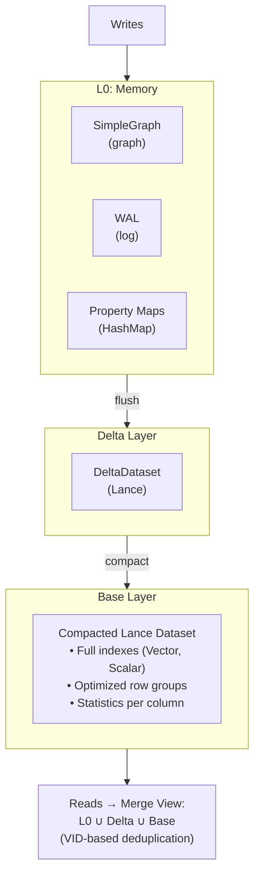

# Storage Engine Internals

Uni's storage engine is architected for high-throughput ingestion and low-latency analytics, leveraging a tiered LSM-tree-like structure backed by **Lance** columnar format. This design enables both OLTP-style writes and OLAP-style analytical queries on the same data.

## Architecture Overview



---

## Tiered Storage Model

### L0: Memory Buffer

The L0 layer handles all incoming writes with maximum throughput.

```rust
pub struct L0Buffer {
    /// In-memory graph structure (SimpleGraph)
    pub graph: SimpleGraph,

    /// Edge tombstones with version tracking
    pub tombstones: HashMap<Eid, TombstoneEntry>,

    /// Vertex tombstones
    pub vertex_tombstones: HashSet<Vid>,

    /// Edge version tracking
    pub edge_versions: HashMap<Eid, u64>,

    /// Vertex version tracking
    pub vertex_versions: HashMap<Vid, u64>,

    /// Edge properties (separate from graph structure)
    pub edge_properties: HashMap<Eid, Properties>,

    /// Vertex properties (separate from graph structure)
    pub vertex_properties: HashMap<Vid, Properties>,

    /// Edge endpoint mapping (eid -> (src, dst, type_id))
    pub edge_endpoints: HashMap<Eid, (Vid, Vid, u16)>,

    /// Current version number
    pub current_version: u64,

    /// Mutation counter for flush triggering
    pub mutation_count: usize,

    /// Write-ahead log reference
    pub wal: Option<Arc<WriteAheadLog>>,

    /// WAL LSN at last flush
    pub wal_lsn_at_flush: u64,
}
```

**Characteristics:**

| Property | Value | Notes |
|----------|-------|-------|
| Format | SimpleGraph + HashMap | Row-oriented for inserts |
| Durability | WAL-backed | Survives crashes |
| Latency | ~550µs per 1K writes | Memory-speed |
| Capacity | Configurable (default 128MB) | Auto-flush when full |

**Write Path:**

```
1. Acquire write lock (single-writer)
2. Append to WAL (sync or async based on config)
3. Insert into SimpleGraph (vertex/edge)
4. Store properties in HashMap
5. Increment mutation counter
6. If threshold reached → trigger async flush
```

### Auto-Flush Triggers

L0 buffer is automatically flushed to L1 (Lance storage) based on two configurable triggers:

| Trigger | Default | Description |
|---------|---------|-------------|
| **Mutation Count** | 10,000 | Flush when mutations exceed threshold |
| **Time Interval** | 5 seconds | Flush after time elapsed (if mutations > 0) |

**Configuration:**

```rust
let config = UniConfig {
    // Flush on mutation count (high-transaction systems)
    auto_flush_threshold: 10_000,

    // Flush on time interval (low-transaction systems)
    auto_flush_interval: Some(Duration::from_secs(5)),

    // Minimum mutations before time-based flush triggers
    auto_flush_min_mutations: 1,
    ..Default::default()
};
```

**Flush Decision Logic:**

```
┌─────────────────────────────────────────────────────────────────────────────┐
│                         AUTO-FLUSH DECISION                                  │
├─────────────────────────────────────────────────────────────────────────────┤
│                                                                             │
│   After each write:                                                         │
│                                                                             │
│   mutations >= 10,000?  ─────Yes────►  FLUSH IMMEDIATELY                   │
│           │                                                                 │
│           No                                                                │
│           │                                                                 │
│           ▼                                                                 │
│   Background timer (every 5s):                                              │
│                                                                             │
│   time_since_last_flush >= 5s                                               │
│   AND mutations >= min_mutations?  ─────Yes────►  FLUSH                    │
│           │                                                                 │
│           No                                                                │
│           │                                                                 │
│           ▼                                                                 │
│   Continue buffering                                                        │
│                                                                             │
└─────────────────────────────────────────────────────────────────────────────┘
```

**Interval Tradeoffs:**

| Interval | Min Mutations | Data at Risk | I/O Overhead | Use Case |
|----------|---------------|--------------|--------------|----------|
| 1s | 1 | ~1s | High | Critical data, local storage |
| **5s** | **1** | **~5s** | **Moderate** | **Default** |
| 30s | 100 | ~30s | Low | Cost-sensitive cloud workloads |
| None | - | All unflushed | None | Legacy behavior, WAL-only |

!!! note "WAL Still Provides Crash Recovery"
    Regardless of flush interval, the Write-Ahead Log ensures no committed data is lost on crash. Time-based flush determines when data reaches L1/cloud storage for query visibility and durability.

### Delta Layer

When L0 fills up, it flushes to the Delta layer as Lance datasets.

```rust
pub struct DeltaDataset {
    /// Lance dataset for deltas
    dataset: Arc<Dataset>,

    /// Edge type this delta is for
    edge_type: EdgeTypeId,

    /// Direction (outgoing or incoming)
    direction: Direction,
}

pub struct L0Manager {
    /// Current L0 buffer
    buffer: Arc<RwLock<L0Buffer>>,

    /// Storage backend
    store: Arc<dyn ObjectStore>,

    /// Schema manager reference
    schema: Arc<SchemaManager>,

    /// Configuration
    config: L0ManagerConfig,
}
```

**Flush Process:**


### L2: Base Layer

The L2 layer contains fully compacted, indexed data.

```rust
pub struct L2Layer {
    /// Main vertex dataset (per label)
    vertex_datasets: HashMap<LabelId, Dataset>,

    /// Main edge dataset (per type)
    edge_datasets: HashMap<EdgeTypeId, Dataset>,

    /// Adjacency datasets (per edge type + direction)
    adjacency_datasets: HashMap<(EdgeTypeId, Direction), Dataset>,

    /// Vector indexes
    vector_indexes: HashMap<IndexId, VectorIndex>,

    /// Scalar indexes
    scalar_indexes: HashMap<IndexId, ScalarIndex>,
}
```

**Compaction Process:**


---

## Lance Integration

Uni uses [Lance](https://lancedb.github.io/lance/) as its core columnar format.

### Why Lance?

| Feature | Benefit |
|---------|---------|
| **Native Vector Support** | Built-in HNSW, IVF_PQ indexes |
| **Versioning** | Time-travel, ACID transactions |
| **Fast Random Access** | O(1) row lookup by index |
| **Columnar Scans** | Efficient analytical queries |
| **Object Store Native** | S3/GCS support built-in |
| **Zero-Copy** | Arrow-compatible memory layout |

### Lance File Format

```
Lance Dataset Structure:

data/
├── _versions/                    # Version metadata
│   ├── 1.manifest               # Version 1 manifest
│   ├── 2.manifest               # Version 2 manifest
│   └── ...
├── _indices/                     # Index data
│   ├── vector_idx_001/          # Vector index
│   │   ├── index.idx
│   │   └── ...
│   └── scalar_idx_002/          # Scalar index
└── data/                         # Column data
    ├── part-0.lance              # Data fragment
    ├── part-1.lance
    └── ...
```

### Data Fragment Structure

```rust
pub struct LanceFragment {
    /// Fragment ID
    id: u64,

    /// Row range in this fragment
    row_range: Range<u64>,

    /// Physical files for each column
    columns: HashMap<String, ColumnFiles>,

    /// Fragment-level statistics
    stats: FragmentStatistics,
}

pub struct FragmentStatistics {
    /// Row count
    num_rows: u64,

    /// Per-column statistics
    column_stats: HashMap<String, ColumnStats>,
}

pub struct ColumnStats {
    null_count: u64,
    min_value: Option<ScalarValue>,
    max_value: Option<ScalarValue>,
    distinct_count: Option<u64>,
}
```

---

## Dataset Organization

### Vertex Datasets

One Lance dataset per vertex label:

```
storage/
├── vertices/
│   ├── Paper/                    # :Paper vertices
│   │   ├── _versions/
│   │   ├── _indices/
│   │   │   ├── embedding_hnsw/   # Vector index
│   │   │   └── year_btree/       # Scalar index
│   │   └── data/
│   ├── Author/                   # :Author vertices
│   │   └── ...
│   └── Venue/                    # :Venue vertices
│       └── ...
```

**Vertex Schema:**

```
┌─────────────────────────────────────────────────────────────────────────────┐
│                           VERTEX DATASET SCHEMA                              │
├─────────────────────────────────────────────────────────────────────────────┤
│                                                                             │
│   System Columns:                                                           │
│   ┌──────────┬──────────┬────────────────────────────────────────────────┐ │
│   │ Column   │ Type     │ Description                                    │ │
│   ├──────────┼──────────┼────────────────────────────────────────────────┤ │
│   │ _vid     │ UInt64   │ Internal vertex ID (label << 48 | offset)     │ │
│   │ _uid     │ Binary   │ UniId (32-byte SHA3-256) - optional           │ │
│   │ _deleted │ Bool     │ Tombstone marker (soft delete)                │ │
│   │ _version │ UInt64   │ Last modified version                         │ │
│   └──────────┴──────────┴────────────────────────────────────────────────┘ │
│                                                                             │
│   User Properties (schema-defined):                                         │
│   ┌──────────┬──────────┬────────────────────────────────────────────────┐ │
│   │ title    │ String   │ Paper title                                    │ │
│   │ year     │ Int32    │ Publication year                               │ │
│   │ abstract │ String   │ Paper abstract (nullable)                      │ │
│   │ embedding│ Vector   │ 768-dimensional embedding                      │ │
│   │ _doc     │ Json     │ Document mode flexible fields                  │ │
│   └──────────┴──────────┴────────────────────────────────────────────────┘ │
│                                                                             │
└─────────────────────────────────────────────────────────────────────────────┘
```

### Edge Datasets

One Lance dataset per edge type:

```
storage/
├── edges/
│   ├── CITES/                    # :CITES edges
│   │   └── ...
│   ├── AUTHORED_BY/              # :AUTHORED_BY edges
│   │   └── ...
│   └── PUBLISHED_IN/
│       └── ...
```

**Edge Schema:**

```
┌─────────────────────────────────────────────────────────────────────────────┐
│                            EDGE DATASET SCHEMA                               │
├─────────────────────────────────────────────────────────────────────────────┤
│                                                                             │
│   System Columns:                                                           │
│   ┌──────────┬──────────┬────────────────────────────────────────────────┐ │
│   │ Column   │ Type     │ Description                                    │ │
│   ├──────────┼──────────┼────────────────────────────────────────────────┤ │
│   │ _eid     │ UInt64   │ Internal edge ID (type << 48 | offset)        │ │
│   │ _src_vid │ UInt64   │ Source vertex VID                              │ │
│   │ _dst_vid │ UInt64   │ Destination vertex VID                         │ │
│   │ _deleted │ Bool     │ Tombstone marker                               │ │
│   │ _version │ UInt64   │ Last modified version                          │ │
│   └──────────┴──────────┴────────────────────────────────────────────────┘ │
│                                                                             │
│   Edge Properties (schema-defined):                                         │
│   ┌──────────┬──────────┬────────────────────────────────────────────────┐ │
│   │ weight   │ Float64  │ Edge weight/score                              │ │
│   │ position │ Int32    │ Author position (for AUTHORED_BY)              │ │
│   │ timestamp│ Timestamp│ When the edge was created                      │ │
│   └──────────┴──────────┴────────────────────────────────────────────────┘ │
│                                                                             │
└─────────────────────────────────────────────────────────────────────────────┘
```

### Adjacency Datasets

Optimized for graph traversal (CSR-style):

```
storage/
├── adjacency/
│   ├── CITES_OUT/                # Outgoing CITES edges
│   │   └── ...
│   ├── CITES_IN/                 # Incoming CITES edges (reverse)
│   │   └── ...
│   └── ...
```

**Adjacency Schema:**

```
┌─────────────────────────────────────────────────────────────────────────────┐
│                         ADJACENCY DATASET SCHEMA                             │
├─────────────────────────────────────────────────────────────────────────────┤
│                                                                             │
│   Chunked CSR Format (one row per chunk of vertices):                       │
│   ┌─────────────┬──────────────┬────────────────────────────────────────┐  │
│   │ Column      │ Type         │ Description                            │  │
│   ├─────────────┼──────────────┼────────────────────────────────────────┤  │
│   │ chunk_id    │ UInt64       │ Chunk identifier                       │  │
│   │ vid_start   │ UInt64       │ First VID in chunk                     │  │
│   │ vid_end     │ UInt64       │ Last VID in chunk (exclusive)          │  │
│   │ offsets     │ List<UInt64> │ CSR offsets (chunk_size + 1 elements)  │  │
│   │ neighbors   │ List<UInt64> │ Neighbor VIDs (flattened)              │  │
│   │ edge_ids    │ List<UInt64> │ Edge IDs (parallel to neighbors)       │  │
│   └─────────────┴──────────────┴────────────────────────────────────────┘  │
│                                                                             │
│   Example (chunk_size=1000):                                                │
│   ┌────────────────────────────────────────────────────────────────────┐   │
│   │ chunk_id: 0                                                         │   │
│   │ vid_start: 0, vid_end: 1000                                         │   │
│   │ offsets: [0, 3, 3, 7, 10, ...]  (1001 elements)                     │   │
│   │ neighbors: [v5, v12, v99, v4, v6, v8, v42, ...]                     │   │
│   │ edge_ids: [e1, e2, e3, e4, e5, e6, e7, ...]                         │   │
│   └────────────────────────────────────────────────────────────────────┘   │
│                                                                             │
└─────────────────────────────────────────────────────────────────────────────┘
```

---

## Write-Ahead Log (WAL)

The WAL ensures durability for uncommitted L0 data.

### WAL Structure

```rust
pub struct Wal {
    /// Active segment being written
    active_segment: Mutex<WalSegment>,

    /// Completed segments awaiting flush
    sealed_segments: Vec<WalSegment>,

    /// Configuration
    config: WalConfig,
}

pub struct WalSegment {
    /// Segment file
    file: File,

    /// Segment sequence number
    sequence: u64,

    /// Current size
    size: usize,
}

pub struct WalConfig {
    /// Segment size before rotation
    max_segment_size: usize,  // Default: 64 MB

    /// Sync mode
    sync_mode: WalSyncMode,

    /// Directory for WAL files
    wal_dir: PathBuf,
}

pub enum WalSyncMode {
    /// fsync after every write (safest, slowest)
    Sync,

    /// fsync periodically (balanced)
    Periodic { interval_ms: u64 },

    /// OS-managed sync (fastest, risk of data loss)
    Async,
}
```

### WAL Mutation Types

The WAL records mutations using the following enum:

```rust
pub enum Mutation {
    /// Insert a new edge
    InsertEdge {
        src_vid: Vid,
        dst_vid: Vid,
        edge_type: u16,
        eid: Eid,
        version: u64,
        properties: Properties,
    },

    /// Delete an existing edge
    DeleteEdge {
        eid: Eid,
        src_vid: Vid,
        dst_vid: Vid,
        edge_type: u16,
        version: u64,
    },

    /// Insert a new vertex
    InsertVertex {
        vid: Vid,
        properties: Properties,
    },

    /// Delete an existing vertex
    DeleteVertex {
        vid: Vid,
    },
}
```

Note: The label_id is encoded in the VID itself, so `InsertVertex` doesn't need a separate label_id field.

### Recovery Process

```rust
impl Wal {
    pub async fn recover(&self, l0: &mut L0Buffer) -> Result<()> {
        // Find all WAL segments
        let segments = self.list_segments()?;

        for segment in segments {
            let reader = WalReader::open(&segment)?;

            while let Some(entry) = reader.next_entry()? {
                // Verify CRC
                if !entry.verify_crc() {
                    // Truncate at corruption point
                    break;
                }

                // Replay entry
                match entry.entry_type {
                    EntryType::InsertVertex { vid, label_id, props } => {
                        l0.insert_vertex(vid, label_id, props)?;
                    }
                    EntryType::InsertEdge { eid, src, dst, type_id, props } => {
                        l0.insert_edge(eid, src, dst, type_id, props)?;
                    }
                    // ... handle other types
                }
            }
        }

        Ok(())
    }
}
```

---

## Snapshot Management

Snapshots provide consistent point-in-time views.

### Manifest Structure

```json
{
  "version": 42,
  "timestamp": "2024-01-15T10:30:00Z",
  "schema_version": 1,

  "vertex_datasets": {
    "Paper": {
      "lance_version": 15,
      "row_count": 1000000,
      "size_bytes": 524288000
    },
    "Author": {
      "lance_version": 8,
      "row_count": 250000,
      "size_bytes": 62500000
    }
  },

  "edge_datasets": {
    "CITES": {
      "lance_version": 12,
      "row_count": 5000000,
      "size_bytes": 200000000
    }
  },

  "adjacency_datasets": {
    "CITES_OUT": { "lance_version": 12 },
    "CITES_IN": { "lance_version": 12 }
  },

  "l1_runs": [
    { "sequence": 100, "created_at": "2024-01-15T10:25:00Z" },
    { "sequence": 101, "created_at": "2024-01-15T10:28:00Z" }
  ],

  "indexes": {
    "paper_embeddings": {
      "type": "hnsw",
      "version": 5,
      "row_count": 1000000
    },
    "paper_year": {
      "type": "btree",
      "version": 3
    }
  }
}
```

### Snapshot Operations

```rust
impl StorageManager {
    /// Create a new snapshot (after flush)
    pub async fn create_snapshot(&self) -> Result<Snapshot> {
        let manifest = Manifest {
            version: self.next_version(),
            timestamp: Utc::now(),
            vertex_datasets: self.collect_vertex_versions(),
            edge_datasets: self.collect_edge_versions(),
            adjacency_datasets: self.collect_adjacency_versions(),
            l1_runs: self.l1_manager.list_runs(),
            indexes: self.collect_index_versions(),
        };

        // Write manifest atomically
        self.write_manifest(&manifest).await?;

        Ok(Snapshot::new(manifest))
    }

    /// Open a specific snapshot for reading
    pub async fn open_snapshot(&self, version: u64) -> Result<SnapshotReader> {
        let manifest = self.read_manifest(version).await?;

        Ok(SnapshotReader {
            manifest,
            vertex_readers: self.open_vertex_readers(&manifest).await?,
            edge_readers: self.open_edge_readers(&manifest).await?,
            adjacency_cache: self.load_adjacency(&manifest).await?,
        })
    }
}
```

---

## Index Storage

### Vector Index Storage

Vector indexes (HNSW, IVF_PQ) are stored within Lance datasets:

```rust
pub struct VectorIndexStorage {
    /// Lance dataset with index
    dataset: Dataset,

    /// Index configuration
    config: VectorIndexConfig,
}

impl VectorIndexStorage {
    pub async fn create_index(
        dataset: &mut Dataset,
        column: &str,
        config: VectorIndexConfig,
    ) -> Result<()> {
        match config.index_type {
            IndexType::Hnsw => {
                dataset.create_index()
                    .column(column)
                    .index_type("IVF_HNSW_SQ")
                    .metric_type(config.metric.to_lance())
                    .build()
                    .await?;
            }
            IndexType::IvfPq => {
                dataset.create_index()
                    .column(column)
                    .index_type("IVF_PQ")
                    .metric_type(config.metric.to_lance())
                    .num_partitions(config.num_partitions)
                    .num_sub_vectors(config.num_sub_vectors)
                    .build()
                    .await?;
            }
        }

        Ok(())
    }
}
```

### Scalar Index Storage

Scalar indexes use Lance's built-in index support:

```rust
pub struct ScalarIndexStorage {
    /// Index metadata
    metadata: ScalarIndexMetadata,
}

impl ScalarIndexStorage {
    pub async fn create_index(
        dataset: &mut Dataset,
        column: &str,
        index_type: ScalarIndexType,
    ) -> Result<()> {
        dataset.create_index()
            .column(column)
            .index_type(match index_type {
                ScalarIndexType::BTree => "BTREE",
                ScalarIndexType::Hash => "HASH",
                ScalarIndexType::Bitmap => "BITMAP",
            })
            .build()
            .await?;

        Ok(())
    }
}
```

---

## Object Store Integration

Uni uses the `object_store` crate for storage abstraction, supporting local filesystems and major cloud providers.

### Supported Backends

| Backend | URI Scheme | Status |
|---------|------------|--------|
| Local filesystem | `file://` or path | **Stable** |
| Amazon S3 | `s3://bucket/path` | **Stable** |
| Google Cloud Storage | `gs://bucket/path` | **Stable** |
| Azure Blob Storage | `az://container/path` | **Stable** |
| Memory | (in-memory) | **Stable** (testing) |

### Using Local Storage

```rust
// Standard local storage
let db = Uni::open("./my-database").build().await?;

// Explicit file:// URI
let db = Uni::open("file:///var/data/uni").build().await?;

// In-memory for testing
let db = Uni::in_memory().build().await?;
```

### Cloud Storage

Open databases directly from cloud object stores:

```rust
// Amazon S3
let db = Uni::open("s3://my-bucket/graph-data").build().await?;

// Google Cloud Storage
let db = Uni::open("gs://my-bucket/graph-data").build().await?;

// Azure Blob Storage
let db = Uni::open("az://my-container/graph-data").build().await?;
```

**Credential Resolution:**

Cloud credentials are resolved automatically using standard environment variables and configuration files:

| Provider | Environment Variables | Config Files |
|----------|----------------------|--------------|
| AWS S3 | `AWS_ACCESS_KEY_ID`, `AWS_SECRET_ACCESS_KEY`, `AWS_REGION` | `~/.aws/credentials` |
| GCS | `GOOGLE_APPLICATION_CREDENTIALS` | Application Default Credentials |
| Azure | `AZURE_STORAGE_ACCOUNT`, `AZURE_STORAGE_KEY` | Azure CLI credentials |

### Hybrid Mode (Local + Cloud)

For optimal performance with cloud storage, use hybrid mode to maintain a local write cache:

```rust
use uni_common::CloudStorageConfig;

let db = Uni::open("./local-cache")
    .cloud_storage(CloudStorageConfig {
        url: "s3://my-bucket/graph-data".to_string(),
        region: Some("us-east-1".to_string()),
        ..Default::default()
    })
    .build()
    .await?;
```

**Hybrid Mode Operation:**

```
┌─────────────────────────────────────────────────────────────────────────────┐
│                            HYBRID MODE                                       │
├─────────────────────────────────────────────────────────────────────────────┤
│                                                                             │
│   WRITES                           READS                                    │
│   ┌─────────┐                      ┌─────────────────────────────────┐     │
│   │ Client  │                      │ Query                           │     │
│   └────┬────┘                      └──────────────┬──────────────────┘     │
│        │                                          │                         │
│        ▼                                          ▼                         │
│   ┌─────────────┐                  ┌─────────────────────────────────┐     │
│   │ Local L0    │◄────────────────►│ Merge View                      │     │
│   │ (WAL+Buffer)│                  │ (Local L0 ∪ Cloud Storage)      │     │
│   └──────┬──────┘                  └─────────────────────────────────┘     │
│          │                                        ▲                         │
│          │ flush                                  │                         │
│          ▼                                        │                         │
│   ┌─────────────┐                                 │                         │
│   │ Cloud       │─────────────────────────────────┘                         │
│   │ (S3/GCS)    │                                                           │
│   └─────────────┘                                                           │
│                                                                             │
└─────────────────────────────────────────────────────────────────────────────┘
```

**Benefits:**
- **Low-latency writes**: All mutations go to local WAL + L0 buffer
- **Durable storage**: Data flushed to cloud storage on interval/threshold
- **Cost efficiency**: Minimize cloud API calls through batching
- **Crash recovery**: WAL provides local durability before cloud sync

---

## Performance Characteristics

### Write Performance

| Operation | Latency | Throughput | Notes |
|-----------|---------|------------|-------|
| L0 insert (vertex) | ~50µs | ~20K/sec | Memory only |
| L0 insert (edge) | ~30µs | ~33K/sec | Memory only |
| L0 batch insert (1K) | ~550µs | ~1.8M/sec | Amortized |
| L0 → L1 flush | ~6ms/1K | - | Lance write |
| L1 → L2 compact | ~1s/100K | - | Background |

### Read Performance

| Operation | Latency | Notes |
|-----------|---------|-------|
| Point lookup (indexed) | ~2.9ms | Hash index |
| Range scan (indexed) | ~5ms + 0.1ms/row | B-tree index |
| Full scan | ~50ms/100K rows | Columnar |
| Vector KNN (k=10) | ~1.8ms | HNSW index |

### Storage Efficiency

| Data Type | Compression | Ratio |
|-----------|-------------|-------|
| Integers | Dictionary + RLE | 5-20x |
| Strings | Dictionary + LZ4 | 3-10x |
| Vectors | No compression | 1x |
| Booleans | Bitmap | 8x |

---

## Configuration Reference

```rust
pub struct StorageConfig {
    // L0 Configuration
    /// Maximum L0 size before flush (bytes)
    pub max_l0_size: usize,  // Default: 128 MB

    /// Maximum mutations before flush
    pub max_mutations_before_flush: usize,  // Default: 10_000

    /// Auto-flush enabled
    pub auto_flush: bool,  // Default: true

    /// Time-based auto-flush interval
    pub auto_flush_interval: Option<Duration>,  // Default: 5 seconds

    /// Minimum mutations for time-based flush
    pub auto_flush_min_mutations: usize,  // Default: 1

    // L1 Configuration
    /// Maximum L1 runs before compaction
    pub max_l1_runs: usize,  // Default: 4

    /// L1 run size threshold for compaction
    pub l1_compaction_threshold: usize,  // Default: 256 MB

    // WAL Configuration
    /// WAL sync mode
    pub wal_sync_mode: WalSyncMode,  // Default: Periodic(100ms)

    /// WAL segment size
    pub wal_segment_size: usize,  // Default: 64 MB

    // Cache Configuration
    /// Adjacency cache size (vertices)
    pub adjacency_cache_size: usize,  // Default: 1_000_000

    /// Property cache size (entries)
    pub property_cache_size: usize,  // Default: 100_000

    // Object Store Configuration
    /// Read-ahead size for sequential scans
    pub read_ahead_size: usize,  // Default: 64 MB

    /// Prefetch enabled
    pub prefetch_enabled: bool,  // Default: true
}
```

---

## Next Steps

- [Vectorized Execution](vectorized-execution.md) — Query execution engine
- [Query Planning](query-planning.md) — From Cypher to physical plan
- [Benchmarks](benchmarks.md) — Performance measurements
