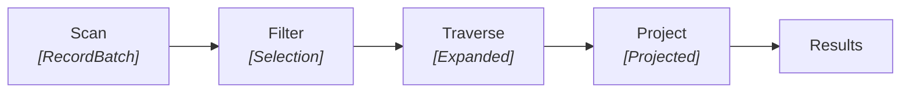
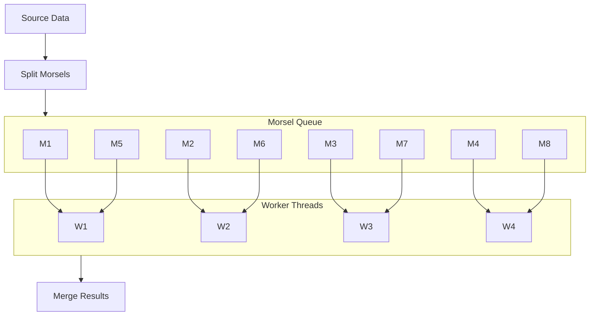

# Vectorized Execution Engine

Uni's query engine uses **vectorized execution** inspired by systems like DuckDB, Velox, and KuzuDB. Instead of the traditional tuple-at-a-time (Volcano) model, the engine processes data in batches (vectors), achieving significant performance gains through reduced interpretation overhead and improved CPU cache utilization.

## Why Vectorized Execution?

Traditional row-at-a-time execution has severe performance limitations:

```
Traditional Volcano Model:
┌──────────────────────────────────────────────────────────────────────────────┐
│   for each row:                                                              │
│     • Virtual function call to get next tuple                                │
│     • Interpret each operator                                                │
│     • Branch mispredictions per tuple                                        │
│     • Poor cache locality                                                    │
│     • ~100 cycles overhead per tuple                                         │
└──────────────────────────────────────────────────────────────────────────────┘

Vectorized Model:
┌──────────────────────────────────────────────────────────────────────────────┐
│   for each batch (1024-4096 rows):                                           │
│     • Single virtual function call                                           │
│     • Amortized interpretation                                               │
│     • Predictable branches                                                   │
│     • Cache-friendly columnar access                                         │
│     • ~5-10 cycles overhead per tuple                                        │
└──────────────────────────────────────────────────────────────────────────────┘
```

**Performance Gains:**
- **10-100x** reduction in interpretation overhead
- **2-4x** improvement from SIMD utilization
- **2-3x** improvement from cache locality

---

## Core Data Structures

### VectorizedBatch

The fundamental unit of data in Uni's execution engine:

```rust
pub struct VectorizedBatch {
    /// Underlying columnar data (Apache Arrow RecordBatch)
    data: RecordBatch,

    /// Selection vector for filtered rows (avoids data copying)
    selection: Option<SelectionVector>,

    /// Number of active (non-filtered) rows
    cardinality: usize,
}

pub struct SelectionVector {
    /// Indices of selected rows
    indices: Vec<u32>,

    /// Original batch size
    original_size: usize,
}
```

**Key Properties:**

| Property | Description |
|----------|-------------|
| **Columnar** | Wraps Apache Arrow RecordBatch for zero-copy |
| **Selection Vector** | Filters rows without physical deletion |
| **Morsel-Sized** | 1024-4096 rows to fit L1/L2 cache |
| **Type-Safe** | Arrow schema enforces column types |

### Selection Vector Optimization

Instead of physically removing filtered rows (expensive copying), we maintain a selection vector:

```
Original Batch:        Selection Vector:        Effective View:
┌─────┬─────┬─────┐   ┌───────┐              ┌─────┬─────┬─────┐
│ VID │ Year│Title│   │ [0,2] │   ──────▶    │ v1  │ 2023│ "A" │
├─────┼─────┼─────┤   └───────┘              │ v3  │ 2021│ "C" │
│ v1  │ 2023│ "A" │                          └─────┴─────┴─────┘
│ v2  │ 2018│ "B" │  (rows 0,2 selected)
│ v3  │ 2021│ "C" │
└─────┴─────┴─────┘
```

**Benefits:**
- No memory allocation for filtering
- Multiple filters compose by ANDing selection vectors
- Original data preserved for backtracking

---

## Physical Operators

### Operator Pipeline Architecture



### Scan Operator

Reads data from Lance datasets in batches:

```rust
pub struct ScanOperator {
    /// Lance dataset reader
    dataset: Arc<Dataset>,

    /// Columns to read
    projection: Vec<String>,

    /// Pushed-down predicates
    filter: Option<Expr>,

    /// Batch configuration
    batch_size: usize,
}

impl ScanOperator {
    async fn next_batch(&mut self) -> Option<VectorizedBatch> {
        // Lance handles predicate pushdown natively
        let batch = self.dataset
            .scan()
            .filter(self.filter.clone())
            .project(&self.projection)
            .batch_size(self.batch_size)
            .next_batch()
            .await?;

        Some(VectorizedBatch::new(batch))
    }
}
```

**Optimizations:**
- **Predicate Pushdown**: Filters pushed to Lance skip entire row groups
- **Column Pruning**: Only requested columns loaded from disk
- **Batch Prefetching**: Next batch loaded while current processes

### Filter Operator

Evaluates predicates using SIMD-accelerated Arrow compute kernels:

```rust
pub struct FilterOperator {
    /// Child operator
    child: Box<dyn PhysicalOperator>,

    /// Predicate expression
    predicate: PhysicalExpr,
}

impl FilterOperator {
    fn filter_batch(&self, batch: VectorizedBatch) -> VectorizedBatch {
        // Evaluate predicate to boolean array
        let mask = self.predicate.evaluate(&batch.data);

        // Combine with existing selection
        let new_selection = match batch.selection {
            Some(sel) => sel.and(&mask),
            None => SelectionVector::from_boolean(&mask),
        };

        batch.with_selection(new_selection)
    }
}
```

**SIMD Acceleration:**

| Operation | Implementation | Speedup |
|-----------|----------------|---------|
| `=`, `<>` | `arrow::compute::eq/neq` | 8-16x |
| `<`, `>`, `<=`, `>=` | `arrow::compute::lt/gt/...` | 8-16x |
| `AND`, `OR` | `arrow::compute::and/or` | 16-32x |
| `IS NULL` | `arrow::compute::is_null` | 16-32x |

### Traverse Operator

The heart of graph query execution—batch adjacency lookups:

```rust
pub struct TraverseOperator {
    /// Child operator (source vertices)
    child: Box<dyn PhysicalOperator>,

    /// Edge type to traverse
    edge_type: EdgeTypeId,

    /// Direction (outgoing, incoming, both)
    direction: Direction,

    /// Adjacency cache reference
    adjacency_cache: Arc<AdjacencyCache>,
}

impl TraverseOperator {
    fn traverse_batch(&self, batch: VectorizedBatch) -> VectorizedBatch {
        // Extract source VIDs
        let src_vids = batch.column::<VidArray>("_vid");

        // Batch lookup neighbors for ALL source vertices
        let (dst_vids, src_indices) = self.adjacency_cache
            .batch_neighbors(src_vids, self.edge_type, self.direction);

        // Build expanded batch: each (src, dst) pair becomes a row
        self.build_expanded_batch(batch, dst_vids, src_indices)
    }
}
```

**Expansion Semantics:**

```
Input Batch:               After Traverse:
┌─────┬─────────┐          ┌─────┬─────────┬─────┬─────────┐
│ VID │  Title  │          │ src │src_title│ dst │dst_title│
├─────┼─────────┤          ├─────┼─────────┼─────┼─────────┤
│ v1  │ "Paper1"│   ──▶    │ v1  │"Paper1" │ v3  │   ?     │
│ v2  │ "Paper2"│          │ v1  │"Paper1" │ v4  │   ?     │
└─────┴─────────┘          │ v2  │"Paper2" │ v5  │   ?     │
                           │ v2  │"Paper2" │ v6  │   ?     │
                           │ v2  │"Paper2" │ v7  │   ?     │
                           └─────┴─────────┴─────┴─────────┘
```

### Project Operator

Computes output expressions:

```rust
pub struct ProjectOperator {
    /// Child operator
    child: Box<dyn PhysicalOperator>,

    /// Output expressions
    projections: Vec<(PhysicalExpr, String)>,
}

impl ProjectOperator {
    fn project_batch(&self, batch: VectorizedBatch) -> VectorizedBatch {
        let columns: Vec<ArrayRef> = self.projections
            .iter()
            .map(|(expr, _)| expr.evaluate(&batch.data))
            .collect();

        let schema = Schema::new(
            self.projections.iter()
                .map(|(_, name)| Field::new(name, ...))
                .collect()
        );

        VectorizedBatch::new(RecordBatch::try_new(schema, columns))
    }
}
```

### Aggregate Operator

Hash-based aggregation with vectorized execution:

```rust
pub struct HashAggregateOperator {
    /// Group-by expressions
    group_by: Vec<PhysicalExpr>,

    /// Aggregate functions
    aggregates: Vec<AggregateExpr>,

    /// Hash table for grouping
    hash_table: HashMap<GroupKey, AccumulatorState>,
}

impl HashAggregateOperator {
    fn aggregate_batch(&mut self, batch: VectorizedBatch) {
        // Compute group keys for all rows
        let keys = self.compute_group_keys(&batch);

        // Vectorized hash computation
        let hashes = self.hash_keys(&keys);

        // Update accumulators in batch
        for (row_idx, hash) in hashes.iter().enumerate() {
            let state = self.hash_table
                .entry(keys[row_idx].clone())
                .or_insert_with(|| self.init_accumulators());

            self.update_accumulators(state, &batch, row_idx);
        }
    }
}
```

**Supported Aggregates:**

| Function | Accumulator | Vectorized |
|----------|-------------|------------|
| `COUNT(*)` | Counter | Yes |
| `COUNT(x)` | Non-null counter | Yes |
| `SUM(x)` | Running sum | Yes |
| `AVG(x)` | Sum + count | Yes |
| `MIN(x)` | Running min | Yes |
| `MAX(x)` | Running max | Yes |
| `COLLECT(x)` | List builder | Yes |

---

## Adjacency Cache (CSR)

The Compressed Sparse Row (CSR) cache is critical for graph traversal performance.

### CSR Structure

```
Adjacency List Representation:

Vertex 0: [1, 2, 3]
Vertex 1: [0, 4]
Vertex 2: [0, 5, 6, 7]
Vertex 3: []
Vertex 4: [1, 2]

CSR Representation:

offsets:  [0,    3,    5,         9,    9,    11]
          │     │     │          │     │     │
          ▼     ▼     ▼          ▼     ▼     ▼
targets:  [1, 2, 3, 0, 4, 0, 5, 6, 7, -, 1, 2]
          ├──────┤├────┤├────────────┤ ├─────┤
          v0 adj   v1    v2 neighbors   v4 adj

neighbors(v) = targets[offsets[v]..offsets[v+1]]
```

### Cache Architecture

```rust
pub struct AdjacencyCache {
    /// Per edge-type, per-direction CSR structures
    csr_maps: HashMap<(EdgeTypeId, Direction), CsrGraph>,

    /// LRU eviction for memory management
    lru: LruCache<CacheKey, CsrChunk>,

    /// Maximum cache size in bytes
    max_size: usize,

    /// Statistics
    stats: CacheStats,
}

pub struct CsrGraph {
    /// Vertex count
    num_vertices: usize,

    /// Offset array (num_vertices + 1 elements)
    offsets: Vec<u64>,

    /// Target vertex IDs
    targets: Vec<Vid>,

    /// Edge IDs (parallel to targets)
    edge_ids: Vec<Eid>,
}
```

### Batch Neighbor Lookup

```rust
impl AdjacencyCache {
    pub fn batch_neighbors(
        &self,
        src_vids: &[Vid],
        edge_type: EdgeTypeId,
        direction: Direction,
    ) -> (Vec<Vid>, Vec<u32>) {
        let csr = self.get_or_load_csr(edge_type, direction);

        let mut dst_vids = Vec::new();
        let mut src_indices = Vec::new();

        for (idx, &vid) in src_vids.iter().enumerate() {
            let start = csr.offsets[vid.local_offset() as usize];
            let end = csr.offsets[vid.local_offset() as usize + 1];

            for i in start..end {
                dst_vids.push(csr.targets[i as usize]);
                src_indices.push(idx as u32);  // Track which src produced this dst
            }
        }

        (dst_vids, src_indices)
    }
}
```

**Performance Characteristics:**

| Operation | Complexity | Notes |
|-----------|------------|-------|
| Single neighbor lookup | O(degree) | Direct array access |
| Batch lookup (n vertices) | O(Σ degrees) | Cache-friendly sequential scan |
| Cache miss | O(chunk_size) | Load from Lance |

### Cache Warming

```rust
// Warm cache for frequently accessed vertices
cache.warm(&high_degree_vertices).await;

// Warm for specific traversal pattern
cache.warm_for_query(&query_plan).await;
```

---

## Morsel-Driven Parallelism

Uni uses morsel-driven parallelism for multi-core utilization.

### Parallel Execution Model



### Pipeline Breakers

Some operators require all input before producing output:

| Operator | Type | Reason |
|----------|------|--------|
| Scan, Filter, Project | Pipeline | Streaming, no buffering |
| Traverse | Pipeline | Per-batch expansion |
| Sort | Breaker | Needs all data for global sort |
| Aggregate | Breaker | Needs all groups |
| Limit | Pipeline | Early termination |

### Exchange Operators

For parallel pipelines, exchange operators redistribute data:

```rust
pub enum Exchange {
    /// Round-robin distribution
    RoundRobin { parallelism: usize },

    /// Hash-based partitioning (for joins/aggregates)
    Hash { key_columns: Vec<usize>, parallelism: usize },

    /// Merge multiple streams
    Merge { input_streams: usize },
}
```

---

## Late Materialization

A key optimization to reduce I/O for wide tables.

### Materialization Strategy

```
Query: MATCH (p:Paper) WHERE p.year > 2020 RETURN p.title, p.abstract

Traditional (Early Materialization):
┌─────────────────────────────────────────────────────────────────────────────┐
│ Scan ALL columns → Filter → Project                                         │
│ I/O: title + abstract + year + embedding + ... (all columns)               │
└─────────────────────────────────────────────────────────────────────────────┘

Late Materialization:
┌─────────────────────────────────────────────────────────────────────────────┐
│ 1. Scan(_vid, year) → Filter(year > 2020) → [1000 → 50 rows]              │
│ 2. Materialize(title, abstract) for 50 surviving VIDs                      │
│ 3. Project                                                                  │
│ I/O: year (1000 rows) + title,abstract (50 rows) = 95% reduction          │
└─────────────────────────────────────────────────────────────────────────────┘
```

### Implementation

```rust
pub struct LateMaterializeOperator {
    /// Child produces VIDs and filter columns
    child: Box<dyn PhysicalOperator>,

    /// Columns to materialize late
    late_columns: Vec<String>,

    /// Property manager for lookups
    prop_manager: Arc<PropertyManager>,
}

impl LateMaterializeOperator {
    async fn materialize(&self, batch: VectorizedBatch) -> VectorizedBatch {
        // Get surviving VIDs
        let vids = batch.selected_vids();

        // Batch-load properties for these VIDs only
        let properties = self.prop_manager
            .batch_load(&vids, &self.late_columns)
            .await;

        // Join properties back to batch
        batch.append_columns(properties)
    }
}
```

### When to Use

| Scenario | Materialization | Rationale |
|----------|-----------------|-----------|
| High selectivity filter | Late | Few rows survive |
| Low selectivity filter | Early | Most rows survive, avoid second scan |
| LIMIT without ORDER BY | Late | Only materialize LIMIT rows |
| Aggregation only | Avoid | Don't load unused columns |

---

## Expression Evaluation

### Physical Expression Types

```rust
pub enum PhysicalExpr {
    /// Column reference
    Column { index: usize, name: String },

    /// Literal value
    Literal { value: ScalarValue },

    /// Binary operation
    BinaryExpr { left: Box<Self>, op: BinaryOp, right: Box<Self> },

    /// Function call
    Function { name: String, args: Vec<Self> },

    /// CASE expression
    Case { when_then: Vec<(Self, Self)>, else_expr: Option<Box<Self>> },
}

impl PhysicalExpr {
    pub fn evaluate(&self, batch: &RecordBatch) -> ArrayRef {
        match self {
            PhysicalExpr::Column { index, .. } => {
                batch.column(*index).clone()
            }
            PhysicalExpr::BinaryExpr { left, op, right } => {
                let l = left.evaluate(batch);
                let r = right.evaluate(batch);
                apply_binary_op(&l, op, &r)  // SIMD kernels
            }
            // ...
        }
    }
}
```

### Vectorized Kernels

```rust
fn apply_binary_op(left: &ArrayRef, op: &BinaryOp, right: &ArrayRef) -> ArrayRef {
    match op {
        BinaryOp::Eq => arrow::compute::eq(left, right),
        BinaryOp::Lt => arrow::compute::lt(left, right),
        BinaryOp::Add => arrow::compute::add(left, right),
        BinaryOp::And => arrow::compute::and(
            left.as_boolean(),
            right.as_boolean()
        ),
        // ... SIMD-accelerated for all operations
    }
}
```

---

## Memory Management

### Batch Memory Lifecycle

```rust
pub struct MemoryPool {
    /// Current allocated bytes
    allocated: AtomicUsize,

    /// Maximum allowed bytes
    limit: usize,

    /// Spill directory for overflow
    spill_dir: PathBuf,
}

impl MemoryPool {
    pub fn allocate(&self, size: usize) -> Result<MemoryReservation> {
        let current = self.allocated.fetch_add(size, Ordering::SeqCst);

        if current + size > self.limit {
            self.allocated.fetch_sub(size, Ordering::SeqCst);
            return Err(MemoryExhausted);
        }

        Ok(MemoryReservation { pool: self, size })
    }
}
```

### Spilling

When memory is exhausted, operators spill to disk:

```rust
impl HashAggregateOperator {
    fn handle_memory_pressure(&mut self) {
        // Partition hash table
        let partitions = self.hash_table.partition(16);

        // Spill cold partitions to disk
        for (idx, partition) in partitions.iter().enumerate() {
            if !partition.is_hot() {
                self.spill_to_disk(idx, partition);
            }
        }
    }
}
```

---

## Performance Tuning

### Batch Size Selection

| Scenario | Recommended Size | Rationale |
|----------|------------------|-----------|
| Simple scans | 8192 | Maximize throughput |
| Complex expressions | 2048 | Fit intermediate results in L2 |
| High selectivity | 4096 | Balance filtering overhead |
| Aggregations | 4096 | Good hash table locality |

### Parallelism Configuration

```rust
let config = ExecutorConfig {
    // Match CPU core count
    worker_threads: num_cpus::get(),

    // Rows per morsel (smaller = better load balancing)
    morsel_size: 4096,

    // Concurrent I/O operations
    max_concurrent_io: 16,

    // Memory limit per query
    memory_limit: 4 * 1024 * 1024 * 1024,  // 4 GB
};
```

---

## Next Steps

- [Storage Engine](storage-engine.md) — Underlying data persistence
- [Query Planning](query-planning.md) — From Cypher to physical plan
- [Benchmarks](benchmarks.md) — Performance measurements
